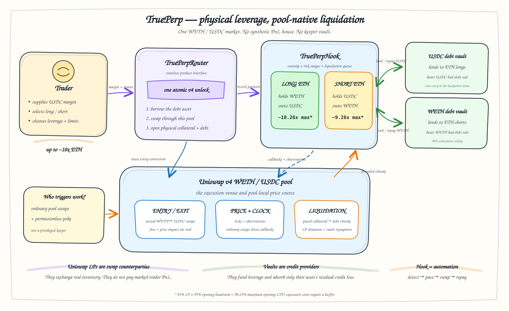

# TruePerp demonstration deployment

This guide deploys the complete TruePerp demonstration market to Unichain
Sepolia. The deployment is intentionally self-contained: it creates capped
mock assets, deploys the TruePerp contracts, initializes one Uniswap v4 pool,
mints a standard PositionManager liquidity NFT, capitalizes two isolated debt
vaults, and activates the market in the product router.

The deployed demo also includes a relayed native-gas faucet. It holds 1 test
ETH and sends 0.05 ETH once to each recipient so a zero-balance judge can begin
without first visiting a third-party faucet.

The resulting market demonstrates protocol mechanics. It does not create an
economically backed ETH/USD market.



## Demonstration assets

The contracts use semantic `BASE` and `QUOTE` roles rather than assuming that
either asset will be `currency0`. Uniswap sorts currencies by address when it
constructs a `PoolKey`.

| Asset | Role | Decimals | Initial treasury supply | Hard cap | One-time faucet |
|---|---|---:|---:|---:|---:|
| TrueETH (`tETH`) | unbacked ETH-like ERC-20 base asset | 18 | 10,000 | 20,000 | 5 per address |
| TrueUSDC (`tUSDC`) | quote, margin, and accounting asset | 6 | 20,000,000 | 40,000,000 | 10,000 per address |

Both tokens are unbacked test assets. Neither token is redeemable for ETH,
USDC, dollars, or any other asset, and neither is intended to preserve an
external market price. The caps bound the mock supply; they do not constitute
reserves. `claim()` is a convenience for a public testnet demonstration,
not a production distribution mechanism.

## Initial capital allocation

`Deploy.s.sol` assigns treasury inventory to two economically different
destinations:

| Destination | TrueETH | TrueUSDC | Economic function |
|---|---:|---:|---|
| Uniswap v4 LP NFT | up to 1,000 | up to 2,000,000 | Executes entry, exit, and liquidation swaps |
| Base lending vault | 1,000 | — | Lends TrueETH to short positions |
| Quote lending vault | — | 2,000,000 | Lends TrueUSDC to long positions |
| Deployer demo reserve | at least 8,000 | at least 16,000,000 | Demonstration inventory outside the protocol |

Pool liquidity and lending-vault capital are not interchangeable. Depositing
tokens into the PositionManager position improves swap depth but does not make
them borrowable. Depositing tokens into a lending vault funds debt legs but
does not provide Uniswap liquidity or earn pool fees.

The pool is initialized with a 0.30% fee, tick spacing 60, a wide-range
position, and a nominal price of 2,000 TrueUSDC per TrueETH. The script retains
a small input buffer when deriving liquidity, so the LP row reports maximum
token budgets rather than guaranteed exact consumption. The starting price is
an AMM state only; it is not an oracle claim about real ETH.

## Deployed demonstration market

The complete market was deployed on Unichain Sepolia on 2026-09-03. The
sanitized, machine-readable record is
[`deployments/unichain-sepolia.json`](deployments/unichain-sepolia.json).

| Component | Address or identifier |
|---|---|
| TrueETH | `0x88b49b8292a9e3174d77c5824dc96E177A56365D` |
| TrueUSDC | `0x1949280616D7Aad370C4fF0BcC2C5a351B90D9e0` |
| TruePerpHook | `0x71280741519FCfc4c17b3cBdAF6e589E84Ba90c0` |
| TruePerpRouter | `0xCE9376A2525CFFDbb1E5f1Fb01e2b04895C1A064` |
| Pool ID | `0xb456c2c3c600c7530c3a3b0d238198a466be1943ae5b5e3fd5cbfb831699e3d9` |
| Base vault | `0x2aC5081BEE73d6d8F49d5238E593af65a6FaE8E9` |
| Quote vault | `0x133A4EAbA992695614bE5545126d67244C51851D` |
| Native gas faucet | `0xf886d5EDF23946103cE5dE1b0F63E242dBFcd0fa` |
| PositionManager LP NFT | token ID `7913` |
| Admission oracle | ready, 9 of 9 observations |

The deployment transactions and exact raw-unit balances are retained in the
manifest; private-key material and signed transaction payloads are not. The
eight time-spaced bootstrap swaps are complete, so the deployed market has
passed its initial oracle-readiness gate.

## Judge demo runbook

The shortest end-to-end path through the hosted or local interface is:

1. Click **Connect wallet** and approve MetaMask. Use **Switch to Unichain
   Sepolia** if the connected chain is wrong. The client requests the official
   chain parameters (chain ID 1301, native symbol ETH, RPC
   `https://sepolia.unichain.org`, explorer `https://sepolia.uniscan.xyz`). The
   same values are documented in Unichain's
   [wallet setup guide](https://developers.uniswap.org/docs/unichain/getting-started/setting-up-a-wallet).
2. Click **Sign to claim 0.05 gas ETH**. This is a `personal_sign` ownership
   message, not a transaction, so the connected wallet can begin with zero
   balance. The server-only relayer pays gas for `claimFor(recipient)`, and the
   contract sends native ETH directly to the connected address.
3. Use the two mock-token faucet actions. They call `claim()` on the deployed token
   contracts and mint 5 tETH and 10,000 tUSDC respectively to the connected
   address. Each token permits exactly one successful claim per wallet. The two
   claims are independent, require separate wallet confirmations, consume gas,
   and remain subject to the token's hard supply cap.
4. Select long or short, set tUSDC margin, target leverage, and slippage, then
   review the live v4 pool quote. The chart is simulated, but this quote is read
   from the deployed TrueETH/TrueUSDC pool. Before submission, the client checks
   the market and admission oracle. Near the LTV limit, the live
   solver can reduce the borrow leg slightly below the nominal leverage target
   to preserve admission headroom after price impact.
5. Approve the router for the **exact tUSDC margin amount** when prompted. If
   the existing allowance already covers the margin, the approval step is
   skipped. Confirm **Open position** to call the deployed
   `TruePerpRouter.openPosition`.
6. Follow the interface's receipt link to
   [Unichain Sepolia Uniscan](https://sepolia.uniscan.xyz/) and verify the
   router transaction and indexed `PerpetualOpened` event.

The current judge flow opens positions and returns the transaction hash and
position ID; it does not yet expose a close-position screen.

Both long and short positions use tUSDC as trader margin. A long borrows tUSDC
from the quote vault and swaps margin plus debt into tETH. A short borrows tETH
from the base vault, sells it into tUSDC, and holds the proceeds with the
trader's margin. The mock-asset faucet therefore makes the product usable by a
judge without requiring external tETH or tUSDC. The native faucet removes the
initial gas dependency while it has capacity and the relay is online. The
[official Unichain faucet directory](https://developers.uniswap.org/docs/unichain/tools/faucets)
remains the fallback.

## Native gas faucet and relay

`NativeGasFaucet` was deployed in transaction
`0x9008a572a89dd18d8b286477df2147a424dc3bc95d25debf3cce830a3770cce0`
with exactly 1 ETH. Its immutable relayer is
`0x476BD498e0CdC6F615253FF06c18461819641088`; only that account can call
`claimFor`. Eligibility is keyed to the recipient, so every address can receive
0.05 ETH once and the initial balance supports 20 successful claims.

The browser never receives a private key. It asks the connected account to sign
a fixed message binding chain ID 1301, its checksummed recipient address, and
the 0.05 ETH amount. The Vercel/Netlify function verifies the signature and
submits the transaction with the server-only relayer.

For local development, `npm run dev` reads the ignored root `.env`. For hosted
deployment, configure this secret in the provider's server environment:

```dotenv
FAUCET_RELAYER_PRIVATE_KEY=0x...
```

Never rename that variable with a `VITE_` prefix: Vite would publish it in the
browser bundle. The optional `FAUCET_ALLOWED_ORIGIN` restricts ordinary browser
requests to the hosted origin, but it is not an anti-Sybil guarantee. This
small testnet faucet is a demo convenience, not production infrastructure.

For a new testnet deployment, simulate before broadcasting:

```bash
forge script script/DeployNativeGasFaucet.s.sol:DeployNativeGasFaucet \
  --rpc-url "$UNICHAIN_RPC_URL"

forge script script/DeployNativeGasFaucet.s.sol:DeployNativeGasFaucet \
  --rpc-url "$UNICHAIN_RPC_URL" --broadcast --slow
```

## Network and official infrastructure

The target is Unichain Sepolia, chain ID 1301. The following public contracts
are the current official Uniswap v4 testnet deployments:

| Contract | Address |
|---|---|
| PoolManager | `0x00b036b58a818b1bc34d502d3fe730db729e62ac` |
| PositionManager | `0xf969aee60879c54baaed9f3ed26147db216fd664` |
| StateView | `0xc199f1072a74d4e905ab1a84d9a45e2546b6222` |
| V4Quoter | `0x56dcd40a3f2d466f48e7f48bdbe5cc9b92ae4472` |
| PoolSwapTest | `0x9140a78c1a137c7ff1c151ec8231272af78a99a4` |
| Permit2 | `0x000000000022d473030f116ddee9f6b43ac78ba3` |

Confirm these values against the
[official Uniswap v4 deployment table](https://developers.uniswap.org/docs/protocols/v4/deployments)
before a fresh deployment. The public RPC and explorer are listed in the
[official Unichain network reference](https://developers.uniswap.org/docs/unichain/technical-information/network-information).

## 1. Prepare the signer

Keep deployment credentials in the ignored root `.env` file:

```dotenv
WALLET_ADDRESS=0x...
WALLET_PRIVATE_KEY=0x...
```

`Deploy.s.sol` reads the key internally and verifies that it derives
`WALLET_ADDRESS`. Do not place either value in `frontend/.env.local`; every
`VITE_*` variable is embedded in the public browser bundle.

Set the public RPC URL in the shell that will run Foundry:

```bash
export UNICHAIN_RPC_URL=https://sepolia.unichain.org
```

The official endpoint is rate-limited and is not intended for production
hosting. A managed RPC is preferable for a live hackathon demo.

## 2. Build and test

```bash
forge build --sizes
forge test --offline
forge test --root lib/truelend --offline
```

The size check is material: `TruePerpHook` is close to the EIP-170 runtime-code
limit. Do not broadcast a build whose hook exceeds that limit.

## 3. Simulate the complete deployment

Run the script without `--broadcast` first. This executes the same deployment
sequence against the selected RPC state without publishing transactions:

```bash
forge script script/Deploy.s.sol:Deploy \
  --rpc-url "$UNICHAIN_RPC_URL" \
  --always-use-create-2-factory \
  -vvvv
```

The CREATE2 flag is required because the hook address is mined for its Uniswap
v4 permission bits. A successful simulation should complete all of the
following operations:

1. deploy TrueETH and TrueUSDC;
2. deploy the vault factory, mined hook, and router;
3. initialize the sorted TrueETH/TrueUSDC `PoolKey` at 2,000 quote per base;
4. configure the perpetual and activate it in the router;
5. mint the wide-range liquidity position through the official
   PositionManager, producing a standard ERC-721 LP position;
6. deposit separate support capital into the base and quote lending vaults; and
7. print the public contract addresses, pool ID, vault addresses, and LP token
   ID.

## 4. Broadcast

After reviewing the simulation output and signer balance, publish the same
script:

```bash
forge script script/Deploy.s.sol:Deploy \
  --rpc-url "$UNICHAIN_RPC_URL" \
  --always-use-create-2-factory \
  --broadcast \
  --slow \
  -vvvv
```

Record only public deployment data. In particular, save the following values
for oracle warm-up and frontend configuration:

```dotenv
TRUE_ETH=0x...
TRUE_USDC=0x...
TRUEPERP_HOOK=0x...
TRUEPERP_ROUTER=0x...
TRUEPERP_POOL_ID=0x...
```

Do not copy Foundry's signed transaction payloads into documentation or the
frontend. A sanitized deployment manifest should contain contract addresses,
the pool ID, LP token ID, chain ID, and public transaction hashes only.

## 5. Warm the pool-local oracle

Pool initialization creates the first observation. TruePerp admission requires
nine usable observations, so the new market needs eight additional successful
swaps. Observations are time-gated: consecutive warm-up swaps must be separated
by at least 60 seconds according to block timestamps.

After adding `TRUE_ETH`, `TRUE_USDC`, and `TRUEPERP_HOOK` to the root `.env`, run:

```bash
forge script script/WarmOracle.s.sol:WarmOracle \
  --rpc-url "$UNICHAIN_RPC_URL" \
  --broadcast \
  --slow \
  -vv
```

`WarmOracle.s.sol` submits one tiny swap per invocation and selects the
direction that steers the tick toward its launch value. Run it eight times,
waiting at least 60 seconds after each successful transaction before submitting
the next one. A reverted or same-window call does not advance the observation
count. Very small swaps may leave the integer tick unchanged; that is valid and
keeps cumulative price drift negligible.

Do not open a leveraged position until the ninth observation is present.
Warming the oracle is a deployment bootstrap step, not a privileged keeper
loop: after bootstrap, ordinary pool swaps record observations and ordinary
flow or permissionless `poke` calls can advance liquidation.

## Adding or changing pool liquidity

The initial position is a standard Uniswap v4 PositionManager NFT owned by the
deployment wallet. It is not liquidity held by the TruePerp hook, a public test
router, or either lending vault.

To add liquidity after deployment, use the official PositionManager and either:

- increase liquidity on the recorded LP token ID; or
- mint another position for the same `PoolKey` and a tick range aligned to tick
  spacing 60.

For ERC-20 settlement, approve Permit2 for both assets and grant the
PositionManager the required Permit2 allowances before calling
`modifyLiquidities`. Bound both token inputs and use a deadline. The
PositionManager action sequence should settle both currencies and mint or
increase the position; direct transfers to PoolManager do not create
liquidity.

Wide liquidity makes the mechanism easy to demonstrate. Concentrated
liquidity is more capital-efficient but can disappear outside its selected
range, so it changes liquidation depth and should be treated as a risk
parameter rather than a cosmetic LP choice.

## Frontend configuration

Copy verified **public** values into `frontend/.env.local` using semantic roles:

```dotenv
VITE_RPC_URL=https://sepolia.unichain.org
VITE_TRUEPERP_ROUTER=0x...
VITE_TRUEPERP_HOOK=0x...
VITE_POOL_MANAGER=0x00b036B58a818B1BC34d502D3fE730Db729e62AC
VITE_POSITION_MANAGER=0xF969Aee60879C54bAAed9F3eD26147Db216Fd664
VITE_STATE_VIEW=0xc199F1072a74D4e905ABa1A84d9a45E2546B6222
VITE_V4_QUOTER=0x56dcd40a3f2d466f48e7f48bdbe5cc9b92ae4472
VITE_POOL_ID=0x...
VITE_BASE_TOKEN_ADDRESS=0x...
VITE_QUOTE_TOKEN_ADDRESS=0x...
VITE_DEPLOYMENT_TX=0x...
VITE_NATIVE_ETH_FAUCET=0xf886d5EDF23946103cE5dE1b0F63E242dBFcd0fa
VITE_NATIVE_FAUCET_API=/api/native-faucet
```

Then build the static application:

```bash
cd frontend
npm ci
npm test
npm run build
```

With the verified deployment values present, the frontend can connect an
injected wallet, read and claim demo-token balances, request a live Uniswap v4
quote, approve the exact tUSDC margin, and submit an opening transaction. The
chart remains simulated and should not be described as an oracle or live price
feed. See [frontend/README.md](frontend/README.md) for the judge walkthrough and
the transaction boundary.
