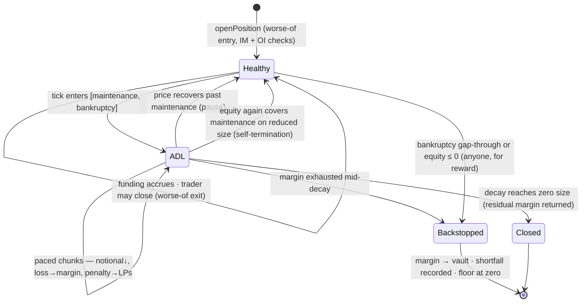
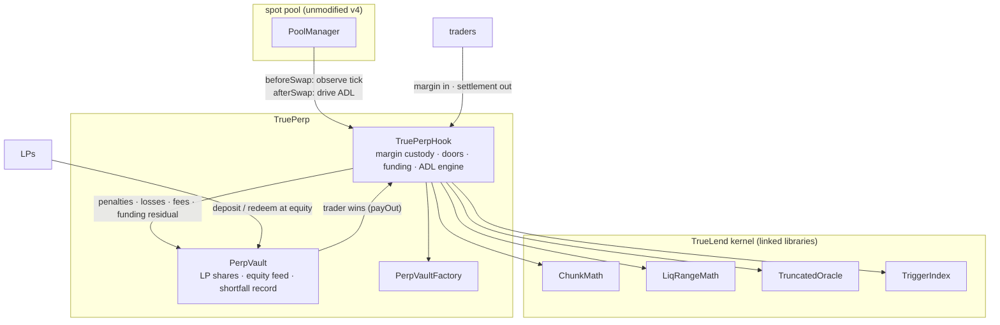

# TruePerp — Design Specification

TruePerp is a perpetual-futures protocol built as a Uniswap v4 hook. It uses no price oracle — the spot pool's own tick is the only price — and it has no liquidation *events*: an endangered position is deleveraged gradually, in small cash-settled steps that pause the moment health returns, and only a hard bankruptcy boundary triggers a full close.

This document is the build specification. The background — why oracle-free liquidation must be active, what every prior perp design teaches, manipulation economics, and the derivations — is in [RESEARCH.md](RESEARCH.md). How the numeric parameters are chosen is in [PARAMETERS.md](PARAMETERS.md). The formal paper is [WHITEPAPER.md](WHITEPAPER.md). TruePerp is the sibling of [TrueLend](https://github.com/queenleoa/TrueLend), which introduced the liquidation kernel this protocol reuses; the two repos share libraries but nothing else — this document stands alone.

---

## 1. What TruePerp is

Start with the venue. A Uniswap v4 pool holds two tokens and quotes an exchange rate between them on a logarithmic grid of **ticks** (0.01% apart). In v4 a pool can attach a **hook** — a contract invoked before and after every swap, able to keep its own state. TruePerp is such a hook, and it turns the spot pool it is attached to into a perpetual-futures market: the pool's **base** token (`currency0`) is the traded asset, its **cash** token (`currency1`) is margin and settlement, and the pool's tick is the market's one and only price. (Native currencies sort to `currency0`, so the cash side is always an ERC-20 by construction.)

A perpetual future lets a trader hold leveraged exposure to the base asset without holding it: post cash margin, choose long or short and a size, and settle the price difference in cash later. Every perp design must answer three questions, and the dominant answers all import fragility:

- **What is the price?** Conventionally an external index oracle. Feeds lag, can be manipulated at their sources, exist only for major assets, and place the protocol's solvency logic downstream of an input it does not control.
- **What anchors the contract to the price?** A **funding rate**, conventionally computed from the gap between the venue's own mark and the external index — so the anchor inherits the oracle.
- **What happens when margin runs out?** A **liquidation event**: the position is closed all at once, by a keeper or an engine, often with a fixed penalty, at the worst possible moment. On thin venues the close itself moves the price into the next trader's threshold — the cascade dynamic — and the backstops behind it (insurance funds, socialized auto-deleveraging) are opaque tails someone eventually eats.

TruePerp replaces all three:

- **The pool's tick is the price.** Positions settle against the venue where the base asset actually trades. Because the spot pool is arbitraged against the wider market, the settlement price *is* the market price — there is no separate "mark" to drift from an "index," and so no mark–index machinery at all.
- **Funding comes from open-interest skew.** The crowded side pays the thin side; the imbalance residual compensates the LPs who carry the net exposure. No external basis is consulted (§6 of RESEARCH.md develops why skew is the right anchor once mark ≡ index by construction).
- **Liquidation is a process, not an event.** A position's margin defines a **liquidation range** on the tick grid: from the *maintenance boundary* (equity = maintenance margin) to the *bankruptcy boundary* (equity = zero). While the tick sits inside that band, the position is **auto-deleveraged in paced chunks** — each chunk closes a slice of notional at the pool's own price, realizes that slice's loss against margin, and pays a small penalty to the LPs taking the other side. If the price recovers, the process pauses. And because deleveraging shrinks notional faster than it burns margin, the process is *self-terminating*: once equity again covers maintenance on what remains, ADL stops and the trader keeps a smaller, healthy position.

The counterparty to all of this is the **PerpVault** — LPs who deposit cash and collectively take the other side of net trader PnL, compensated by open/close fees, ADL penalties, and the funding residual, with any bankruptcy tail past the backstop recorded on-chain as a declared shortfall rather than an implicit one.

One structural simplification falls out of cash settlement and is worth stating early: **the hook never swaps.** TrueLend's chunks must sell real collateral into the pool; TruePerp's chunks are pure bookkeeping between hook-held margin and the vault. The spot pool contributes its tick (the price), its swaps (the pacing clock), and its recent history (the manipulation filter) — and is otherwise untouched. No PoolManager unlock is ever needed outside the pool's own callbacks, and ADL adds zero sell pressure to the market whose price is being watched.

> Why must deleveraging be something the hook actively *does*, rather than margin parked in the pool that "liquidates itself" as price crosses it? Because passive pool liquidity can only ever trade *against* the direction of a price move, and closing a losing long requires selling the base as it falls — trading *with* the move. That impossibility (proved in [RESEARCH.md §2](RESEARCH.md)) rules out passive designs for margin exactly as it does for loan collateral. The cash-settled corollary is stronger still: TruePerp's ADL needs no trade at all, only a price — so the kernel's one historical cost, execution slippage, vanishes.

---

## 2. A position, end to end

Section 1 becomes concrete with one worked position. The pool is ETH/USDC with ETH at **$2,500**. Alice posts **1,000 USDC** margin and opens a **5× long**: 2 ETH of base exposure (~$5,000 notional).

### 2.1 Opening

Two prices matter at the door, and the protocol assumes both can be lied about briefly. The **entry price** is the *worse of* the live tick and the hook's filtered record of recent ticks — for a long, the *highest* of {truncated median, spot, recent extremes}, so a one-block dip cannot buy Alice a cheap entry. Call it $E \approx 2{,}501$.

Three checks then gate the open:

- **Initial margin**: margin must cover `initialMarginBps` (default 5%) of notional — maximum leverage 20×. Alice's 1,000 against ~5,002 notional is 20% margin: comfortably 5×.
- **Open-interest cap**: total open notional after her trade must stay under `oiCapBps` (default 50%) of the vault's LP equity — the house must be able to carry the book.
- **Not fully backed**: margin ≥ notional has no liquidation price and is rejected (`FullyBackedPosition`) — leverage below 1× belongs in spot.

An open fee (10 bps of notional, ~5 USDC) goes to the vault; the hook custodies the remaining **995 USDC** of margin. Nothing else moves — no borrowing, no swap. The position is bookkeeping: `(trader, isLong, margin, baseSize, entryPrice, fundingSnapshot)`.

### 2.2 The range her margin implies

Where should intervention begin? Not at a configured threshold — at the price her own margin arithmetic dictates. With per-base margin $\mu = M/B = 995/2 = 497.5$ and maintenance ratio $m = 2\%$:

$$
P_{bk} = E - \mu = 2{,}003.5 \qquad\text{(equity} = 0\text{)}, \qquad
P_{start} = \frac{P_{bk}}{1-m} \approx 2{,}044.4 \qquad\text{(equity} = m \times \text{notional)}.
$$

The band $[2{,}003.5,\ 2{,}044.4]$ is her **liquidation range** — registered as two boundary ticks in a per-pool bitmap, exactly as TrueLend registers a loan's range. Its width is not a parameter; it is her distance from maintenance to bankruptcy, ≈ $m \cdot P$. Higher leverage buys a narrower band and therefore faster obligatory pacing — the risk she chose, made geometric.

### 2.3 While the position is healthy

ETH stays above $2,044 and the hook does nothing for this position — no per-swap bookkeeping, no storage touched. Detection is O(boundaries crossed): `afterSwap` walks only the registered ticks between the previous and current tick (§4.3), so the perp market costs ordinary swappers nothing until a boundary actually crosses.

The only slow force is **funding**. Suppose longs outweigh shorts 2:1 (skew $+1/3$): at the default full-skew rate of 100%/yr, Alice pays about $33\%/yr \times \$5{,}000 \approx \$4.6$ per day, credited to shorts pro-rata with the imbalance residual going to the vault. Funding settles lazily against a global accumulator whenever her position is next touched. She can close at any moment — at the worse-of *exit* price for her side (a long exits at the *lowest* of median/spot/extremes), so a one-block pump cannot inflate her way out either. Sustained profit requires the ~9-minute filter to agree the move is real; that lag is the price of manipulation-proof doors, charged symmetrically at entry and exit.

### 2.4 Price enters the range: gradual ADL

ETH slides to $2,040 — 30-odd ticks inside her range. The swap that crossed her boundary also, in the same transaction, flips her position into an ADL episode and executes the first chunk. From here every swap in the pool (or anyone calling `poke()`, paid from the penalty flow) advances the process one paced step:

```
chunk = (baseSize remaining / 100)         ← base slice: 1% of what's left
      × min(minutes since last chunk, 5)   ← quiet gaps catch up, capped
      × (1 + depth into range)             ← deeper → faster
      × (1 + position ÷ in-range depth)    ← big vs the book → faster
      … never more than 1% of the pool's measured in-range base depth
```

Concretely the first chunk closes ≈ 0.023 ETH of her exposure at the pool's price: the realized loss on that slice, $(E - P)\cdot c \approx (2{,}501-2{,}040)\times 0.023 \approx \$10.6$, plus a small time-scaled penalty (§4.2), moves from her margin to the vault; her `baseSize` and the pool's aggregate open interest shrink. **Nothing is sold** — the market feels no ADL flow.

Two facts make this benign, and §4.4 proves them: closing at the market price leaves *equity unchanged* (only penalties consume it), and each chunk lowers the maintenance requirement faster than anything erodes equity — so decay strictly improves health.

### 2.5 Recovery, or self-termination — the two good endings

If ETH climbs back above $2,044.4, the episode pauses: the position leaves the queue lazily, `timeInLiquidation` stops accruing, and nothing further happens unless the price returns. Alice has paid a few dollars of penalties on the churned slice — not a 5–15% liquidation haircut on her whole position.

If instead ETH lingers at $2,040, chunks continue — but not forever. Deleveraging at depth $d$ into the runway needs to shed only fraction $\approx d$ of the notional before equity again covers maintenance on the remainder (§4.4). The engine checks exact health before every chunk and, the moment the arithmetic says healthy, pauses the episode. Alice ends with a *smaller, healthy* 4-ish× position — deleveraged precisely as much as the price action demanded, and no more. This is the perp-shaped analog of a TrueLend loan's decay terminating when the debt hits zero.

### 2.6 When gradualism isn't enough: the backstop

Two conditions end the soft treatment; each makes the position closable by **anyone**, for a reward carved out of the penalty flow — a bounty, not a keeper dependency:

1. **Bankruptcy crossed** — the tick has passed $P_{bk}$: pacing lost the race to a gap.
2. **Equity gone at the filtered price** — funding drag or a partial gap consumed margin faster than chunks could deleverage.

The backstop closes the remainder at the worse-of exit price. Margin absorbs what it can; any residue is recorded on-chain (`PerpVault.totalShortfall`) and borne by LPs — a declared waterfall, priced into LP yield, not an implicit one. There are **no negative trader balances and no socialized clawbacks from other traders**: the hard floor at zero is what full collateralization buys, and it is a feature to state, not hide.

### 2.7 The lifecycle, compactly



---

## 3. The system that runs it

Three contracts, four reused libraries:

| Piece | Role |
|---|---|
| [`TruePerpHook`](src/TruePerpHook.sol) | the market: margin custody, worse-of doors, funding, the ADL engine in `afterSwap`/`poke`, backstops. 22,726 bytes — under EIP-170 with room |
| [`PerpVault`](src/PerpVault.sol) | the LP house, one per pool: share accounting over *equity* (cash − unrealized trader PnL at the filtered price), win payouts, the shortfall record |
| [`PerpVaultFactory`](src/PerpVaultFactory.sol) | keeps the vault's creation code out of the hook's bytecode — the same EIP-170 device as TrueLend's `VaultFactory`, learned the same way |
| `ChunkMath` · `LiqRangeMath` · `TruncatedOracle` · `TriggerIndex` | **TrueLend's liquidation kernel**, imported via the `lib/truelend` submodule: pacing formula, range/price math, manipulation filter, tick bitmap. On networks where TrueLend is deployed these link against the same on-chain library singletons |



The core/periphery rule is inherited from TrueLend (its DESIGN §3.1): core is what runs in callbacks or custodies funds; periphery only reads or re-signs. Everything above is core; the natural first periphery is a lens (health, funding owed, ADL preview), deferred until an integrator needs it.

One flow difference from TrueLend deserves emphasis: **no unlock, ever.** TrueLend's `poke` must unlock the PoolManager because chunks swap; TruePerp's `poke` is a plain external call that moves ERC-20 cash between the hook and the vault. This removes an entire class of reentrancy surface and makes keeper gas costs trivially predictable.

---

## 4. The ADL engine, precisely

### 4.1 What kind of thing this is

The same object as TrueLend's engine — a **conditional dribble**: a time-paced schedule (TWAMM-like) gated on the tick being inside a per-position range — with the execution leg deleted. Where a loan's chunk must *sell collateral into the pool* (and therefore worry about depth, slippage, and its own price impact), a perp's chunk *marks a slice of exposure to the current price and settles it in cash*. Pacing still matters — it is what makes the intervention gradual, reversible, and fair — but it paces bookkeeping, not flow.

### 4.2 One chunk, step by step

For each due position (in range, `chunkInterval` elapsed), `_executeChunk`:

1. **Reads the price** $P$ at the current tick and **checks health first**: if $\text{margin} - \text{unrealized loss} \geq m \times \text{notional}$, the episode pauses right here (§4.4) — no chunk.
2. **Sizes the chunk** through `ChunkMath` — remaining × time-catch-up × range-depth × pressure, capped at `maxChunkDepthBps` of the measured in-range *base* depth. Depth still caps the chunk even though nothing is sold: it keeps the deleveraging rate proportional to how consequential the market's own move was, and it is the knob the parameter model tunes.
3. **Settles funding** against the global accumulator (lazy, snapshot-based).
4. **Realizes the slice**: loss $= |P - E| \cdot c$ (adverse by construction inside the range) and penalty $= P \cdot c \times \text{penaltyBps}$ move from margin to the vault. The penalty is time-scaled (1× to 5× over hours in liquidation) and **capped at a quarter of the maintenance gap** — the same quarter-gap rule TrueLend's parameter model forced, inherited here by passing the maintenance analog into `ChunkMath.penaltyBps`, so the penalty can never make recovery arithmetically impossible.
5. **Pays the executor**: on the `poke` path a reward (10 bps) is *carved out of the penalty*, never charged on top — TrueLend's audited reward rule, adopted as law. The swap path pays no reward (the hook sees the router, not the trader).
6. **Shrinks the books**: `baseSize`, and the pool's `baseLong/Short` + cost aggregates that feed funding skew and the vault's equity view.
7. **Handles the two terminal edges**: size reaching zero closes the position and returns residual margin; margin exhausted mid-chunk short-circuits to the backstop, closing the remainder at $P$ and recording the uncovered residue.

Per-transaction work is hard-bounded: at most 2 chunks per swap, 10 per poke, 8 trigger ticks and 32 position refreshes per walk — the same budgets as TrueLend, for the same reason (the market must never be expensive to *use* because someone else is being deleveraged).

### 4.3 Finding crossings without scanning positions

Positions register their two boundary ticks in a per-pool bitmap (`TriggerIndex`); `afterSwap` walks only set bits between the previous and current tick, with a persisted cursor for resumability and the walk budgets above. Registration is capped at 32 positions per trigger tick — the per-walk refresh budget — because a more crowded tick would stall the cursor permanently (TrueLend's audit finding; the cap ships in the shared library). The refresh operation is idempotent: it recomputes in-range status from the current tick, which is what makes capped, lazy, resumable walking safe.

### 4.4 Why decay terminates: the equity-invariance lemma

Write a long's equity at price $P$ as $\text{Eq} = M + (P - E)B = B\,\delta$ where $\delta = P - P_{bk}$ is the distance to bankruptcy. Close a chunk $c$ at price $P$: margin absorbs the slice's loss, and the new bankruptcy price works out to leave

$$
\text{Eq}' = (B - c)\,\delta' = B\,\delta = \text{Eq}.
$$

**Closing exposure at the market price cannot change equity** — of course: no value is created or destroyed by realizing a mark. Only the *penalty* (≤ $m/4$-rate on the churned slice) and funding consume equity during an episode. Meanwhile the maintenance requirement is $m \cdot P \cdot (B - c)$: it *falls* with every chunk. Health $= \text{Eq}/(m \cdot P \cdot B_{\text{remaining}})$ therefore rises monotonically at constant price, and crosses 1 after shedding fraction

$$
r \;\approx\; d \;=\; 1 - \frac{\delta}{m P} \quad\text{(the position's depth into its runway)},
$$

plus a small penalty correction. A position 40% into its runway needs to shed ~40% of its size, not all of it. The engine's pre-chunk health check (§4.2 step 1) is this lemma made operational, and it is why ADL ranges can safely stay **fixed at open**: deleveraging only moves the true maintenance price further *below* the registered trigger, so the bitmap fires conservatively early and the exact arithmetic — not the bitmap — decides whether anything actually happens.

### 4.5 What keeps the protocol solvent

Five layers, each catching what the previous one lets through:

1. **Initial margin** (≥ 2× maintenance, validated in `setConfig`) — positions start with runway.
2. **Paced ADL** — inside the runway, exposure shrinks continuously; the trader is never all-in at the boundary.
3. **Exact health checks** — every chunk re-verifies; recovery in either variable (price or size) pauses the process.
4. **The backstop** — past bankruptcy or at zero equity, anyone closes the remainder for a carved reward, at the worse-of price.
5. **The declared LP tail** — what a gap consumes beyond margin is `recordShortfall`ed and socialized to LP equity, visibly. LPs are paid for exactly this tail via fees, penalties, and the funding residual.

Conservation is structural rather than hoped for: **hook cash = Σ live margins** at all times (funding residuals and realized flows leave at accrual; every close routes the *entire* margin through the vault and pays all sinks — trader equity, executor reward — from there), and **LP equity = vault cash − unrealized trader PnL at the filtered price**, floored at zero for share pricing with redemptions additionally bounded by physical cash.

---

## 5. The LP side

`PerpVault` is deliberately dumb: shares over equity, two hook-only mutators (`payOut`, `recordShortfall`), and a virtual-share offset blunting inflation attacks. The one subtle line is the equity feed: unrealized trader PnL is priced at the **filtered median**, not spot — an LP deposit or redemption cannot be timed against a one-block price push. The corollary is a redemption gate: `redeem` is bounded by physical cash, so paper losses to traders must *realize* before LPs can exit through them. LP yield = open/close fees + ADL penalties + funding residual − net trader wins − recorded shortfalls; every term is observable on-chain.

Utilization discipline is at the door, not the exit: opens revert once total notional exceeds `oiCapBps` of LP equity, so the book the house carries is sized to the house.

---

## 6. The price judgments, hardened

Oracle-free does not mean judgment-free; it means every judgment uses the pool's own history, hardened. The filter is TrueLend's `TruncatedOracle` unchanged: observations at most once per 60 s, recorded from the *pre-swap* tick (a swap never writes its own price), each clamped to ±9,116 ticks of movement, a median over the last 9, raw min/max extremes that only widen the answer, and a bootstrap gate — no positions until the ring fills (~9 minutes).

Four moments consult it:

| Moment | Price used | Why |
|---|---|---|
| entry | worse-of {median, spot, extremes}, against the opener | a flash dip cannot cheapen a long's entry |
| exit (trader close, backstop) | worse-of, against the closer | a flash pump cannot inflate a long's exit |
| funding accrual | median | skew manipulation cannot be amplified by a same-block push |
| LP equity & the equity backstop (reason 2) | median | deposits, redemptions and force-closes cannot be timed against spot |

ADL chunk pricing is the one deliberate exception: chunks realize at **spot**. The episode is continuous and rate-limited, a manipulated tick buys an attacker at most one bounded chunk of someone else's position at a price the attacker paid swap fees and arbitrage losses to set, and using spot is what makes decay track the actual market. The manipulation-economics treatment is RESEARCH.md §5.

---

## 7. Parameters

| | Parameter | Default | Meaning |
|---|---|---|---|
| **Trader-chosen** | size & margin | — | leverage up to `1e4/initialMarginBps`; the margin *is* the range placement |
| **Pool owner** (validated) | `maintenanceMarginBps` | 200 | runway width ≈ m; the LT-gap analog. Validated ≤ 2000 |
| | `initialMarginBps` | 500 (20×) | validated ≥ 2 × maintenance |
| | `targetChunks` / `chunkInterval` / `timeCapX` | 100 / 60 s / 5× | TrueLend pacing, unchanged |
| | `maxChunkDepthBps` | 100 | chunk ≤ 1% of measured in-range base depth |
| | `basePenaltyBps` | 50 | time-scaled; hard-capped at m/4 by the kernel |
| | `openFeeBps` / `closeFeeBps` | 10 / 10 | to the vault |
| | `rewardBps` | 10 | poke/forceClose bounty, carved from the penalty |
| | `fundingKBps` | 10,000 | 100%/yr at full skew ≈ 0.011%/h |
| | `oiCapBps` | 5,000 | open notional ≤ 50% of LP equity |
| | `minMargin` | 0 | dust floor, per deployment |
| **Protocol constants** | walk caps (8/32) · 2 chunks/swap, 10/poke · 32 ids/tick · filter (60 s × 9, ±9,116) | — | mechanical safety; not risk-tuned |

`setConfig` rejects liquidation-bricking values (zero pacing fields, maintenance out of band, IM below 2×m) — the validation lesson from TrueLend's audit, applied from day one. The quantitative choices — what m each volatility tier can safely offer, and therefore what leverage — are PARAMETERS.md's subject.

---

## 8. Build status

v0.1: mechanism complete; **10 tests green** (margin-derived range placement, open guards, in-range decay with pause-on-recovery, self-terminating health restoration, bankruptcy backstop with recorded LP shortfall, worse-of PnL round trips both directions, skew funding with residual accrual, LP equity accounting round trip); hook 22,726 bytes; **not deployed, not audited**. Deliberate v0.1 scope: full-close only (no partial close or margin top-up), no position netting, ADL ranges fixed at open (conservative per §4.4), funding residual transfers assume hook-held margins cover transient imbalances between lazy settlements. The perp-profile parameter run (leverage axis through TrueLend's episode engine and replay harness) is specified in PARAMETERS.md and pending.

---

## Appendix A — The lending ↔ perps dictionary

| TrueLend (loans) | TruePerp (perps) | What changed and why |
|---|---|---|
| collateral (pool token) | margin (cash) | perps are cash-settled; custody stays at the hook |
| debt to a lender vault | notional against the LP vault | no borrowing; exposure is bookkeeping |
| LT chosen by borrower | maintenance ratio per pool; leverage chosen by trader | the trader's margin, not a threshold choice, places the range |
| range start at LTV = LT | range start at equity = m·notional | same object: the price where intervention begins |
| range width √2 (configured) | width ≈ m (derived) | a perp's runway is its margin arithmetic |
| chunk = collateral sold into pool | chunk = notional closed in cash | execution leg deleted; slippage term s vanishes |
| decay ends at debt = 0 | ADL ends at health restored | the equity-invariance lemma makes this the natural terminator |
| penalty donated to in-range LPs | penalty to PerpVault LPs | the compensated absorbers, in each design's native venue |
| interest (utilization-priced) | funding (skew-priced) | both are the carry cost that prevents free option-holding |
| worse-of at origination only | worse-of at entry AND exit | a perp has two price-critical doors |
| bad debt: reserves → lender haircut | shortfall: recorded → LP equity | declared waterfall in both |

## Appendix B — v4 facts this design relies on

The hook receives `beforeSwap`/`afterSwap` on every swap and `afterInitialize` at pool creation, with permissions encoded in its address (mined via CREATE2). The pre-swap callback sees the pre-swap tick — the filter's manipulation resistance depends on recording *that*. Unlike TrueLend, no fact about hook-initiated swaps, `donate()`, or unlock semantics is needed: TruePerp only reads `slot0`/liquidity and moves ERC-20s.

## Appendix C — Glossary (reference)

**base / cash** — the pool's `currency0` (traded asset) / `currency1` (margin + settlement). **notional** — base size × price, in cash. **equity** — margin + unrealized PnL − funding owed. **maintenance (m)** — the equity ratio below which ADL runs. **runway** — the price band from maintenance to bankruptcy, width ≈ m. **ADL** — auto-deleveraging: chunked, cash-settled notional reduction. **skew** — (long OI − short OI)/(total OI), the funding driver. **worse-of** — max/min over {filtered median, spot, recent extremes}, chosen against whoever is acting. **shortfall** — loss past a bankrupt position's margin, recorded and borne by LPs.
