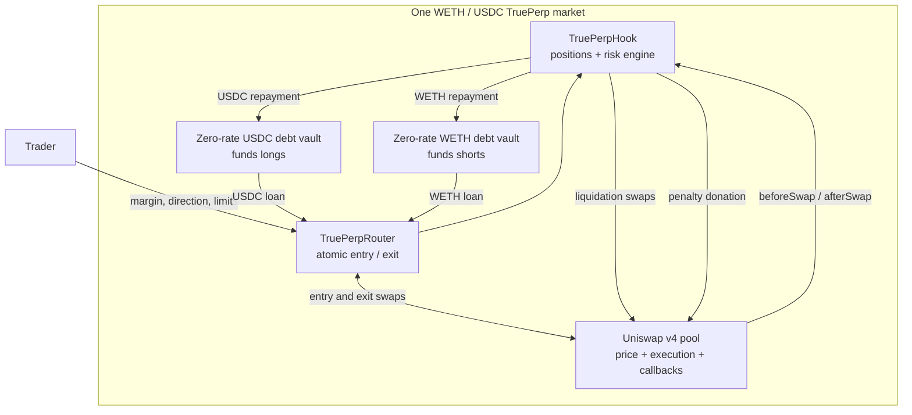
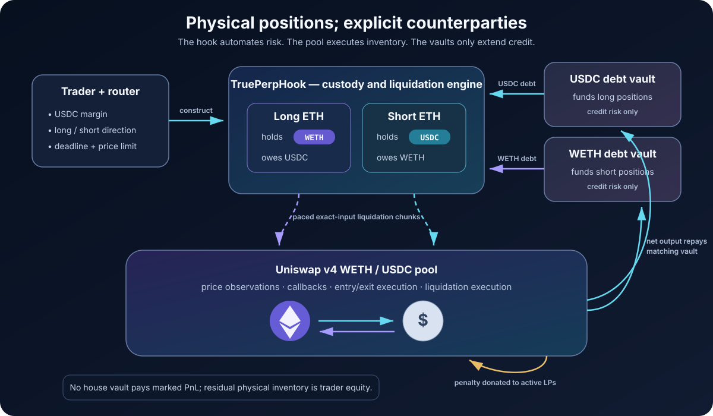
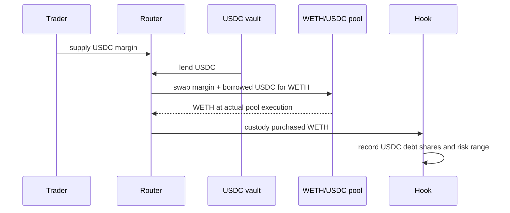
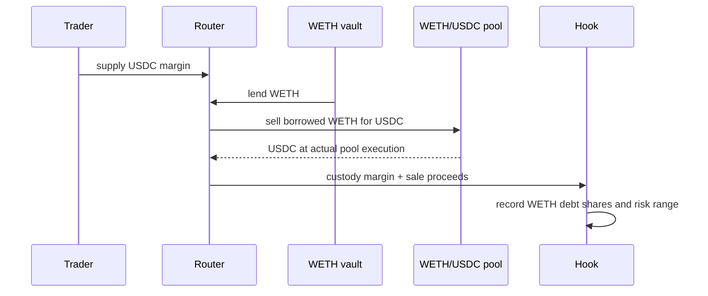
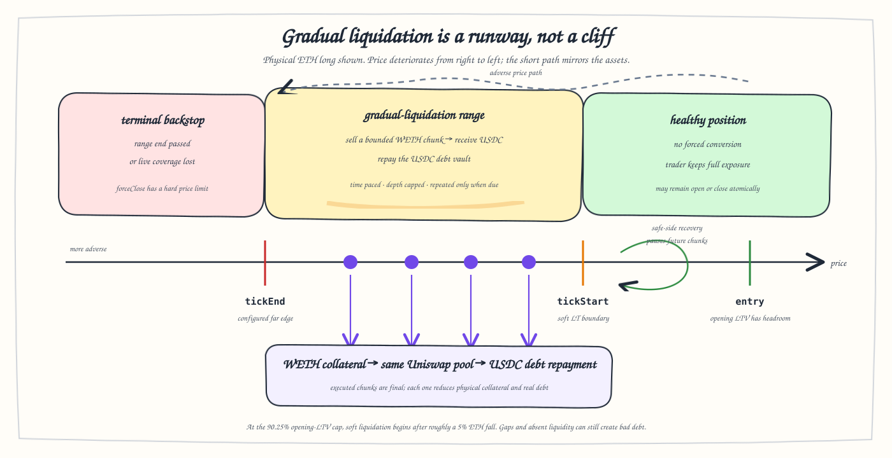

# TruePerp: Physical Perpetual-Margin Design

## Document status

This document specifies the target hackathon architecture for TruePerp. It
replaces the earlier cash-settled counterparty model with expiry-free positions
backed by real spot inventory and real debt. The objective is to preserve
TrueLend's defining mechanism: liquidation is an active, gradual swap process
driven by Uniswap v4 callbacks, and in-range LPs are paid for absorbing that
flow.

The shipped v0 deliberately uses zero-rate debt vaults. Fixed debt keeps the
opening liquidation ticks valid and isolates the swap-driven liquidation
mechanism from the separate research problem of maintaining debt-aware trigger
indexes. The design is intentionally narrow: it is a mechanism prototype, not a
claim of production readiness or free production financing.

## 1. Research objective

TruePerp asks:

> Can a Uniswap v4 market support perpetual-style leveraged longs and shorts
> whose unsafe exposure is unwound gradually by the market's own activity,
> without an external price oracle or privileged liquidation keeper?

The design follows four principles:

1. **Physical representation.** Every long or short is reducible to collateral
   held by the hook and debt owed to a single-asset vault.
2. **Venue consistency.** The attached pool supplies observations, triggers,
   entry and exit execution, and liquidation execution.
3. **Active gradual liquidation.** Unsafe collateral is swapped in bounded,
   time-paced chunks; liquidation is not a bookkeeping mark.
4. **Explicit risk ownership.** Trader equity is first loss, and the isolated
   vault that lent the debt asset bears any remaining credit loss.

TruePerp does not target cross-margin, arbitrary synthetic indexes, or
permissionless long-tail listings in the demo.

## 2. Market definition

A market is one Uniswap v4 pool and the components attached to it:

| Field | Meaning |
|---|---|
| `base` | asset whose directional exposure is traded; WETH in the demo |
| `quote` | unit used to display price and PnL; USDC in the demo |
| `poolId` | approved WETH/USDC pool using the TruePerp hook |
| `baseIsCurrency0` | explicit token orientation; never inferred economically from address order |
| `baseVault` | isolated, zero-rate WETH support vault that funds shorts |
| `quoteVault` | isolated, zero-rate USDC support vault that funds longs |
| `riskConfig` | admission, range, pacing, chunk-depth, and backstop parameters |

An ETH/USDC market supports ETH longs and ETH shorts. It cannot support BTC,
SOL, an equity, or an arbitrary index because those assets are neither priced
nor exchanged by the pool. A different underlying requires a different
base/quote market.

All token-decimal conversion and pool orientation must be explicit. Internal
math may use fixed-point values, but assets enter and leave accounting in their
native units.

## 3. System architecture





### 3.1 TruePerpHook

The hook is the core protocol. It:

- custodies each position's physical collateral;
- records its debt shares in exactly one lending vault;
- maintains pool-local observations and trigger indexes;
- computes risk from collateral and current debt;
- activates and pauses liquidation episodes;
- executes bounded swaps while the PoolManager is unlocked;
- donates the liquidation penalty to active pool LPs; and
- routes net proceeds to debt repayment.

The hook holds no discretionary house capital and does not promise to settle a
synthetic mark from pooled cash.

### 3.2 Uniswap pool

The pool performs four inseparable jobs:

1. price discovery for the base/quote pair;
2. observation history for borrower-adverse admission checks;
3. callback-driven progress for the liquidation queue; and
4. real execution for entry, exit, and every liquidation chunk.

Uniswap LPs are the immediate trade counterparties. When a long is liquidated,
they buy WETH from the position; when a short is liquidated, they sell WETH to
the position. They receive swap fees and a separate donation from the
liquidation penalty.

### 3.3 Debt vaults

Each market has two isolated, single-asset lending vaults:

- the quote vault lends USDC to construct ETH longs; and
- the base vault lends WETH to construct ETH shorts.

Vault shares represent support capital's cash plus performing debt. A hard
utilization ceiling preserves repayment and withdrawal liquidity. If a position
exhausts its collateral before extinguishing its debt, the affected vault share
price absorbs the shortfall; losses cannot cross into the other asset vault or
another pool.

`PerpLendingVaultFactory` fixes every v0 rate-model component and the reserve
factor to zero. The protocol seeds these vaults to demonstrate real debt
origination and repayment, but that capital earns no interest. The vaults do not
calculate or pay trader PnL; they only originate, account for, and retire debt.

### 3.4 Router

The router is the canonical TruePerp periphery. Within one PoolManager unlock it
can borrow, swap, deposit the acquired collateral into the hook, and settle all
pool deltas. It assigns base/quote semantics, requires explicit market
activation, and accepts a deadline and user price or output limit.

The demo router accepts USDC margin for both directions. For a long it swaps the
trader's USDC together with borrowed USDC into WETH. For a short it sells
borrowed WETH and combines the USDC output with the trader's USDC. This uniform
input is a router convenience; the core still records only physical collateral
and debt.

### 3.5 Prototype boundary

`TruePerpHook` directly inherits the TrueLend kernel. Consequently, the
lower-level `open` entrypoint remains public in v0 and is not restricted to the
router. A direct caller can bypass router activation, quote-margin construction,
and the router's market semantics, including in an activated pool. This is a
known prototype limitation: the router is the canonical product path, but it is
not yet an enforced authorization boundary.

Any additional pool initialized with the hook receives its own pair of isolated
vaults through the inherited initialization callback. Unless the owner activates
that pool in `TruePerpRouter`, it is not a canonical TruePerp market. Its assets
and debt remain isolated by pool ID, although the inherited raw interface is
still reachable. A production version should expose a router-authorized opening
path while leaving repayment and liquidation permissionless.

## 4. Counterparty map

The word “counterparty” is ambiguous unless the obligation is named.

| Obligation | Counterparty | Risk accepted |
|---|---|---|
| execute WETH/USDC conversion | in-range Uniswap LPs | curve inventory and adverse-selection risk |
| provide leverage capital | protocol-seeded debt-vault support capital | utilization, liquidity, and bad-debt risk; no v0 yield |
| supply first-loss equity | trader | loss of posted collateral value |
| schedule and perform liquidation | hook | deterministic execution; no balance-sheet risk |

The Uniswap pool is therefore the liquidation venue and immediate execution
counterparty. It is not a GMX-style house whose reserves can be debited at an
arbitrary mark. The lending vault is a creditor, not a keeper. The hook replaces
the privileged keeper as the liquidation algorithm.

## 5. Position construction

Let `P` denote USDC per WETH. The vault still represents debt with shares, but
its v0 borrow index is constant because every configured rate is zero. Current
debt therefore equals the outstanding principal, subject only to repayments and
integer rounding.

### 5.1 Long ETH

A long holds `C_b` WETH and owes `D_q` USDC. The router combines the trader's
USDC margin with borrowed USDC and swaps the complete amount into WETH.



Long equity in quote units is

$$
Q_L(P)=P C_b-D_q.
$$

The quote-denominated profit is the increase in the value of held WETH after
debt and costs. There is no separate party that must manufacture an uncapped
cash payout when ETH rises.

### 5.2 Short ETH

A short holds `C_q` USDC and owes `D_b` WETH. The base vault lends WETH, the
router sells it through the pool, and the hook holds the proceeds together with
the trader's USDC margin.



Short equity in quote units is

$$
Q_S(P)=C_q-PD_b.
$$

If ETH falls, less USDC is required to buy back the WETH debt and the retained
remainder is the trader's profit. If ETH rises, the collateral buys progressively
less WETH, so liquidation must begin before coverage is exhausted.

### 5.3 Leverage and admission

Define loan-to-value as debt value divided by collateral value:

$$
\mathrm{LTV}_{long}=\frac{D_q}{P C_b},
\qquad
\mathrm{LTV}_{short}=\frac{P D_b}{C_q}.
$$

A position opens only if its borrower-adverse admission LTV is below the chosen
liquidation threshold with configured headroom:

$$
\mathrm{LTV}_{open}\le h\,\mathrm{LT},\qquad 0<h<1.
$$

The UI may express the same relation as initial margin and leverage. The core
stores collateral and debt because those quantities are what can actually be
swapped and repaid.

With equity $Q$, the directional leverage mappings are

$$
\lambda_{long}=\frac{P C_b}{Q_L}
=\frac{1}{1-\mathrm{LTV}_{long}},
\qquad
\lambda_{short}=\frac{P D_b}{Q_S}
=\frac{\mathrm{LTV}_{short}}{1-\mathrm{LTV}_{short}}.
$$

The asymmetry is physical: a long converts the trader's own USDC plus borrowed
USDC into base exposure, while a short's directional exposure is the borrowed
base sold. A five-times long therefore opens near 80% LTV; a five-times short
opens near 83.33% LTV before fees and price impact.

## 6. Price and execution model

TruePerp distinguishes a **risk price** from an **execution result**.

- The current pool tick determines range crossings and live health.
- A truncated history of pre-swap ticks supplies a borrower-adverse bound for
  opening risk. A trader cannot push spot in the same transaction and borrow
  against the favorable side of that move.
- Entry, voluntary close, liquidation, and backstop amounts settle from actual
  Uniswap balance deltas, never from a marked transfer between internal cash
  ledgers.
- User actions carry deadlines and price limits. Forced terminal execution also
  uses a bounded price limit and may partially fill.

The pool is still manipulable if it is thin. The protection is compositional:
adverse admission pricing, actual execution cost, time pacing, per-chunk depth
caps, vault utilization limits, and a curated demo pool. No one statistic makes
a weak venue safe.

## 7. Liquidation range

The liquidation range is fixed when a position opens. In v0, zero-rate debt is
the invariant that makes a fixed trigger index coherent. Let $D_q$ and $D_b$
denote outstanding principal before any repayment. The long-side process is
illustrated below; the short side mirrors its directions.



The unaligned long start price is

$$
P_{start,L}=\frac{D_q}{\mathrm{LT}\,C_b},
$$

and zero-cost bankruptcy lies at

$$
P_{bank,L}=\frac{D_q}{C_b}.
$$

For a short, liquidation begins as price rises to

$$
P_{start,S}=\frac{\mathrm{LT}\,C_q}{D_b},
$$

with zero-cost bankruptcy at

$$
P_{bank,S}=\frac{C_q}{D_b}.
$$

These bankruptcy prices describe principal before execution costs; they are not
promised execution points. The start tick is aligned toward earlier
intervention. The far edge is then placed by the configured range width and
enables the terminal backstop if price passes it. A separate live coverage check
uses remaining collateral, outstanding debt, and a slippage buffer, so partial
execution or penalties can also make terminal conversion eligible.

The shipped mechanism has no interest-only drift: the borrow index is constant,
and neither principal nor trigger ticks move merely because time passes. A
production carry model cannot simply turn the inherited utilization curve back
on. It must recompute debt-aware start and end ticks, deregister stale
boundaries, and safely register the replacements without losing crossings or
exceeding callback work bounds. That dynamic re-registration is intentionally
outside v0.

## 8. Keeperless gradual liquidation

```mermaid
sequenceDiagram
    participant S as Ordinary swapper
    participant U as Uniswap PoolManager
    participant H as TruePerpHook
    participant L as In-range LPs
    participant V as Debt vault

    S->>U: ordinary WETH/USDC swap
    U->>H: beforeSwap (record pre-swap tick)
    U->>H: afterSwap (new tick)
    H->>H: walk crossed triggers; process bounded queue
    H->>U: exact-input liquidation chunk
    U-->>H: actual output amount
    H->>L: donate penalty in output asset
    H->>V: repay debt with net output
    H->>H: update collateral and debt shares
```

### 8.1 Chunk direction

| Position | Unsafe move | Collateral swap | Repaid debt |
|---|---|---|---|
| ETH long | ETH falls | WETH → USDC | USDC debt |
| ETH short | ETH rises | USDC → WETH | WETH debt |

This is the stop-side flow that passive concentrated liquidity cannot express.
The hook must execute it actively.

### 8.2 Chunk size

A chunk is due no more than once per configured interval per position. Its size
combines:

- a base fraction of remaining collateral;
- elapsed-time catch-up, subject to a cap;
- depth through the position's liquidation range;
- position pressure relative to that depth; and
- an absolute maximum collateral input derived from currently active depth.

The exact function must be monotone in elapsed time and bounded in collateral
input. Pool output is the actual execution delta and is not the quantity capped
by `ChunkMath`. A single triggering swap may process only a small fixed number
of chunks, so queue work and induced order flow remain bounded.

### 8.3 Accounting for one chunk

For a long chunk selling `c_b` WETH:

1. reduce attributed WETH collateral by the amount actually consumed;
2. receive actual USDC proceeds from the pool;
3. carve the executor reward, if any, from the liquidation penalty;
4. donate the remaining penalty to active Uniswap LPs; and
5. repay as many USDC debt shares as the net proceeds extinguish.

The short path is identical with the assets reversed. If repayment clears the
debt, remaining collateral returns to the trader. If collateral reaches zero
first, the remaining debt enters the loss waterfall.

At a fixed price and before costs, exchanging collateral for debt improves LTV
whenever collateral value exceeds debt. Penalties and slippage consume equity,
so the accounting uses actual balances and actual debt shares. Processing
continues at the configured cadence while the pool tick remains in the range;
it pauses when price returns to the safe side. A later adverse crossing resumes
the same gradual process.

Completed chunks are final. “Reversible liquidation” means the process can stop
and preserve the unconverted remainder; it does not reverse prior swaps.

## 9. Expiry-free financing and deliberate zero carry

The shipped v0 has neither a synthetic funding ledger nor borrow interest.
`PerpLendingVaultFactory` deploys both support vaults with zero base rate, zero
slopes, zero rate ceiling, and zero reserve factor. Long USDC principal and short
WETH principal remain constant until repaid. Protocol-seeded vault capital
therefore earns no yield in this version.

This is a deliberate mechanism-isolation decision. The inherited trigger index
registers two price ticks once, at opening. If variable interest increased debt,
the true LT boundary would move even when the pool price did not. No tick would
be crossed, so a position could deteriorate silently and eventually require a
terminal force close rather than the gradual path being demonstrated. Merely
enabling the existing rate curve would therefore make the fixed-index model
internally inconsistent.

A production design may charge borrow carry or add a separate funding rule, but
it must also maintain debt-aware triggers. At minimum it needs atomic boundary
deregistration and re-registration, a policy for when accrued debt moves a
boundary across the current tick, and bounded work for many positions whose
indexes change together. Until that state machine exists, v0 intentionally
leaves the financing subsidy visible instead of implying unsupported yield.

There is no practical scheduled maturity. Because the inherited compact
position layout requires a nonzero 32-bit term, the demo encodes this with the
maximum term, about 136 years. That sentinel is an implementation convenience,
not literal mathematical infinity.

## 10. Solvency and loss allocation

Physical positions remove the ordinary winner-payout liability of an unhedged
cash-settled house:

- long gains are embodied in appreciated WETH held by the position;
- short gains are funded by the retained proceeds of the opening WETH sale; and
- every close realizes through a real pool swap.

The remaining insolvency mode is credit shortfall: collateral cannot repurchase
or repay all debt after a gap, severe price impact, liquidation penalties, or
lost liquidity.

The loss waterfall is:

1. position collateral and trader equity;
2. any reserves recorded by the vault; and
3. that vault's support capital through a lower share price.

The generic vault preserves reserve-first accounting, but the v0 factory sets
both interest and the reserve factor to zero. It therefore builds no
interest-funded reserve balance: absent another future reserve source, the
protocol-seeded support capital directly owns the residual credit tail.

Losses never jump from the WETH vault to the USDC vault or between markets.
Uniswap LPs are not assessed an off-curve deficit; their exposure is limited to
the swaps and inventory risk they chose by providing liquidity.

Required accounting invariants include:

$$
\text{hook token balance}
\;\ge\;
\sum \text{active position collateral in that token},
$$

$$
\text{vault total debt shares}
=
\sum \text{position debt shares attributed to that vault},
$$

and

$$
\text{support-capital-owned vault assets}
=
\text{cash excluding reserves}+\text{performing debt}.
$$

A write-off removes non-performing debt from this equality. Any nonzero vault
reserves are released against the loss before support-capital assets decline.

New borrowing is bounded by admission LTV, available vault cash, and the vault's
hard utilization ceiling. It is **not** currently subject to a position-size or
range-depth admission cap. The canonical router must execute its entry swap and
honor the user's output limit, but the implemented depth formula caps only the
collateral input of each liquidation chunk. A depth-aware opening cap is a
recommended extension. Vault shares may be redeemed only from available cash;
capital already lent to an open position cannot be withdrawn as though it
remained idle.

## 11. Rejected alternative: a physically hedged counterparty vault

One alternative preserves a familiar synthetic-perp interface: a two-asset
vault accepts the opposite side of trader PnL and hedges that exposure through
the WETH/USDC pool.

For every synthetic long of `B` WETH, the vault must buy and reserve roughly
`B` WETH. For every synthetic short, it must borrow or sell `B` WETH and retain
the USDC proceeds needed for later repurchase. As positions change, a hedge
engine opens, rebalances, and unwinds those legs.

We reject that architecture for the hackathon for three reasons.

First, the hedge introduces a second state machine. Trader exposure and hedge
inventory can diverge because of partial fills, price limits, callbacks,
front-running, or unavailable liquidity. The protocol then needs basis and
rebalance accounting in addition to liquidation accounting.

Second, a two-asset vault needs defensible share valuation and withdrawal rules
while it carries reserved inventory, unsettled hedge PnL, and asymmetric long
and short obligations. This is the complexity that the earlier single-cash
model failed to make solvent, moved rather than removed.

Third, an exact physical hedge converges algebraically to the selected design.
A hedged long is WETH held against USDC financing; a hedged short is USDC sale
proceeds held against WETH financing. Recording those asset-and-debt legs
directly avoids a synthetic claim and eliminates hedge drift.

A production protocol might later wrap the two lending vaults and a liquidity
position into a portfolio product. That wrapper would be a capital-allocation
layer, not the counterparty required for TruePerp positions.

## 12. Backstop and degraded modes

The system distinguishes recoverable illiquidity from realized insolvency.

- **No active pool liquidity:** do not fabricate a settlement price. The
  canonical router cannot complete its required entry swap; an existing
  position remains open and liquidation retries when executable liquidity
  returns.
- **Price limit reached:** accept a partial fill, preserve unconsumed collateral,
  and keep the position eligible for later processing.
- **Coverage breached:** attempt a slippage-bounded terminal conversion. If debt
  remains after collateral is exhausted, write it off through the lending-vault
  waterfall.
- **Insufficient observation history:** reject new positions until the
  pool-local filter is ready.
- **Excessive utilization:** let the lending vault reject new debt while
  repayment and liquidation remain available.
- **Quiet market:** permit rewarded `poke` calls using the same bounded engine.

The protocol never transfers a live position to a discretionary backstop vault
and never settles at a governance-selected mark.

## 13. Operating assumptions and known limitations

The design assumes:

- the designated WETH/USDC pool has meaningful, persistent liquidity and
  independent arbitrage;
- ordinary swaps or permissionless pokes arrive often enough to advance due
  chunks;
- WETH and USDC behave as standard tokens;
- vault utilization leaves sufficient cash for normal operations; and
- administrative risk parameters cannot be changed retroactively without
  notice in a production version.

The design does not eliminate liquidation-induced market impact. A falling ETH
long still sells WETH, and a rising ETH short still buys it. TruePerp bounds and
paces that flow; it does not claim to abolish it. A sufficiently fast gap can
cross the liquidation range before enough chunks execute and create bad debt.

Pool-local pricing also means pool-local truth. If the selected pool diverges
from the wider market, TruePerp follows this pool until arbitrage restores the
relationship. Supporting arbitrary assets or external indexes would require a
different oracle and settlement design.

## 14. Hackathon parameter profile

The demo should prefer observable behavior over maximum leverage:

| Parameter | Demo direction |
|---|---|
| Market | one WETH/USDC pool |
| Demo leverage selection | approximately 3–5×; not an enforced maximum or security cap |
| Borrow amount | capped by admission LTV, vault cash, and the hard utilization ceiling; not by range depth |
| Liquidation cadence | visible multi-step decay over several swaps |
| Chunks per callback | small fixed constant |
| Chunk input | collateral amount capped as a small fraction of active range depth |
| Admission price | borrower-adverse pool-local filtered value |
| Voluntary execution | deadline plus caller price/output bound |
| Terminal execution | bounded price movement with partial-fill retry |
| Carry | zero borrow rate and no funding ledger in v0 |

These are design directions, not calibrated production values. Tests and a
small path simulation should justify the exact numbers used in the demo. A
position-size admission cap tied to range depth is a recommended extension; the
implemented depth constraint applies to each liquidation chunk.

## 15. Test status and required properties

The root suite contains 14 TruePerp integration tests. The inherited TrueLend
engine has 94 tests in its own project; a root `forge test` does not substitute
for running that suite when the kernel changes. Together, the suites should
establish the following properties:

1. Long entry borrows USDC, swaps it for WETH, and leaves the hook holding the
   recorded WETH collateral.
2. Short entry borrows WETH, swaps it for USDC, and leaves the hook holding the
   recorded USDC collateral.
3. An ordinary swap crossing a trigger can cause a bounded nested liquidation
   swap in the same transaction.
4. A long chunk sells WETH and repays only the USDC vault; a short chunk buys
   WETH and repays only the WETH vault.
5. The liquidation donation accrues to active Uniswap LPs, while a poke reward
   is carved from—not added on top of—the penalty.
6. Collateral, PoolManager deltas, repayments, donations, rewards, and returned
   surplus conserve both tokens.
7. A safe-side range exit pauses processing, and a later adverse boundary
   crossing re-enqueues the position.
8. A zero-liquidity or price-limit condition cannot invent proceeds or erase
   debt; partial work remains retryable.
9. The v0 factory deploys zero-rate vaults, and merely advancing time does not
   change position debt or move the economic liquidation boundary.
10. Uncovered debt reduces only the vault that originated it, applying any
    recorded reserve before support capital.

Fuzz and invariant tests should vary token decimals, token ordering, swap
direction, elapsed time, concentrated-liquidity depth, and multiple positions
sharing trigger ticks. Dynamic debt-index growth belongs to the future carry
design and must be paired with trigger re-registration tests.

## 16. Demonstration sequence

A persuasive demo follows one position end to end:

1. seed WETH/USDC spot liquidity and capitalize both debt vaults;
2. open a five-times ETH long and show its WETH collateral and USDC debt;
3. move ETH downward with an ordinary pool swap until the range is crossed;
4. show the hook execute one small WETH-to-USDC chunk in the same transaction;
5. show the LP donation, USDC debt repayment, and improved position LTV;
6. repeat across several swaps to visualize gradual decay;
7. move price out through the safe-side boundary and show liquidation pause with
   remaining WETH intact; and
8. run the mirrored short path, where USDC buys WETH to repay the base vault.

The demo's central observation should be visible from token balances, not only
events: liquidation exchanges real collateral, repays real debt, and rewards the
LPs that actually absorb the trade.

## 17. Conclusion

TruePerp is an expiry-free, pool-native margin market. Its perpetual exposure is
physical: hold the appreciating asset and owe the financing asset for a long;
hold sale proceeds and owe the underlying for a short. That representation
removes the need for an unhedged cash house and makes liquidation the same
operation as TrueLend's core insight—an active, paced conversion through the
market that triggered it.

Uniswap LPs execute and are paid for the liquidation flow. Protocol-seeded
vault capital funds v0 leverage and owns the remaining credit tail without
earning interest. The hook connects those roles without pretending that this
mechanism-only financing profile is a finished production market.
