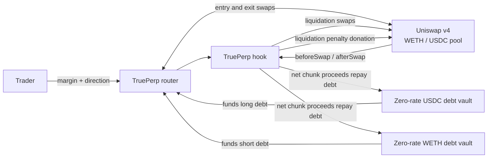

# TruePerp

**Up to 10x expiry-free ETH leverage with keeperless, gradual liquidation on
Uniswap v4.**


TruePerp represents leverage with real assets and real debt. A position is not
an unbacked cash promise against a house vault:

- an ETH long holds WETH and owes USDC;
- an ETH short holds USDC and owes WETH; and
- when either position becomes unsafe, the hook converts its collateral into
  its debt asset through the ETH/USDC pool in small, paced swaps.

The demo accepts USDC margin for either direction. A long swaps that margin and
its borrowed USDC into WETH; a short adds the USDC received from selling
borrowed WETH to its margin.

Leverage is the product, not an incidental use of the lending vaults. For the
curated WETH/USDC market, the recommended major-asset configuration uses a 95%
liquidation threshold. The inherited 95% opening-headroom rule then caps
admission at 90.25% LTV. Before pool costs, that corresponds to 10.26x long
directional leverage and 9.26x short directional leverage. TruePerp therefore
uses **up to 10x ETH leverage** as its product headline, while interfaces and
tests retain the direction-specific values.

Ordinary pool activity drives that process. The swap that moves the pool into a
position's liquidation range calls the hook, and the hook can execute a bounded
liquidation chunk before the transaction finishes. If price exits the registered
range on its safe side, future chunks pause; a later adverse crossing resumes
them. A permissionless, rewarded `poke` provides a fallback for quiet markets;
no privileged keeper receives the position or chooses its execution price.

This repository is a hackathon research prototype. It is intended to make the
mechanism concrete and testable, not to hold production funds.

## Architecture at a glance



The hook is the liquidation engine. The two lending vaults only fund debt legs:
the USDC vault lends to longs and the WETH vault lends to shorts. Uniswap LPs
are the immediate counterparties to every real trade and earn ordinary swap
fees. A liquidation-penalty donation accrues to liquidity active at the
post-chunk tick, which is not necessarily the same pro-rata set that filled the
whole swap. The relevant debt vault's support capital bears any residual bad
debt after position collateral is exhausted.

In v0 that support capital is protocol-seeded and the two debt vaults charge a
zero borrow rate. This is a deliberate mechanism-isolation choice, not a claim
that production leverage can be financed for free: keeping debt principal fixed
also keeps the registered liquidation ticks valid. Adding carry requires
debt-aware trigger re-registration as the borrow index changes.

There is no separate GMX-style pool that pays marked trader profit. A profitable
position is paid by the inventory it already holds: appreciated WETH for a long,
or the USDC proceeds retained after borrowed WETH was sold for a short.

## Leverage is the primary feature

TruePerp turns TrueLend's leveraged-position route into the main trading
interface. The economic loop is familiar:

```text
margin -> borrow the other pool asset -> swap -> hold leveraged inventory
```

The implementation performs the loop atomically inside one Uniswap v4
PoolManager unlock. It does not create a recursive chain of loans:

| Direction | Atomic construction | Resulting position |
|---|---|---|
| Long ETH | combine USDC margin with borrowed USDC, then buy WETH | hold WETH; owe USDC |
| Short ETH | borrow WETH, sell it, then add the USDC proceeds to margin | hold USDC; owe WETH |

Let `LTV` mean debt value divided by held-collateral value. Directional leverage
after opening is

```text
long leverage  = 1 / (1 - LTV)
short leverage = LTV / (1 - LTV)
```

The formulas differ because the long's WETH holding contains both
margin-financed and debt-financed WETH, whereas the short's ETH exposure is only
the borrowed WETH. At the recommended 90.25% opening cap:

| Direction | Theoretical maximum before execution costs | Practical product label |
|---|---:|---|
| Long ETH | 10.26x | up to 10x |
| Short ETH | 9.26x | up to about 9x |

At the exact 90.25% cap, soft liquidation begins after roughly a 5% ETH fall
for a long or a 5.26% rise for a short. Higher leverage therefore makes the
gradual-liquidation mechanism central to the product, not a remote failure path.
The 5x default demo offers more runway; the near-limit demo is a stress case.

These are risk-policy limits, not guaranteed quotes. The router records actual
AMM output, and the hook values the result at a borrower-adverse pool price.
Swap fees and price impact therefore reduce the notional obtainable from a
fixed USDC deposit and can make a request near the limit revert. Vault cash and
the 90% utilization ceiling can constrain position size independently of the
leverage ratio.

After opening, `TruePerpRouter.getPositionMetrics` reports collateral value,
debt value, equity, LTV, and direction-correct leverage at current pool spot for
display. These live metrics do not replace the hook's more conservative
borrower-adverse price for admission.

This is implemented behavior, not a documentation-only multiplier:

- [`openPosition`](src/TruePerpRouter.sol) performs the atomic borrow-and-swap
  construction, opens against the actual received collateral, and rejects LT
  above the canonical market's hard 95% policy even if the inherited hook
  configuration is raised; and
- [`getPositionMetrics`](src/TruePerpRouter.sol) derives current LTV and
  direction-correct leverage from on-chain balances and pool spot.

The present transaction interface accepts `margin` and `borrowAmount`, rather
than a leverage multiplier. A demo frontend should translate its leverage
selector into a direction-specific, execution-buffered borrow quote, then show
the returned on-chain metrics after entry.

For example, ignoring execution costs, 1,000 USDC can construct a 5x long by
borrowing about 4,000 USDC and buying about 5,000 USDC of WETH. A 5x short
instead borrows about 5,000 USDC worth of WETH, sells it, and holds about 6,000
USDC. Equal borrow amounts do not produce equal labeled leverage in the two
directions.

## What does ETH/USDC trade?

An ETH/USDC market supports **ETH exposure only**.

| Direction | Position holds | Position owes | Adverse liquidation trade |
|---|---|---|---|
| Long ETH | WETH | USDC | sell WETH for USDC |
| Short ETH | USDC | WETH | buy WETH with USDC |

The pair cannot price or settle a BTC, SOL, equity, or arbitrary-index position.
A different underlying requires its own liquid base/quote pool and debt vaults.
This restriction is a direct consequence of removing the external oracle: the
same venue that defines the price must also execute the position's conversions.

## Why this is a perpetual-margin product

Positions have no practical scheduled expiry: the inherited compact layout uses
the maximum 32-bit term, approximately 136 years. The shipped v0 debt rate is
zero, so principal does not drift away from the fixed liquidation range. This is
an inventory-backed perpetual-margin construction rather than a cash-settled
futures exchange. The separate observation clock also uses 32-bit timestamps
and must be migrated before its 2106 wrap; the prototype is not claiming that
this code can run unchanged for the entire term sentinel.

For a long holding `B` WETH with `Dq` USDC debt at ETH price `P`, equity in USDC
is

```text
long equity = P * B - Dq
```

For a short holding `Cq` USDC with `Db` WETH debt,

```text
short equity = Cq - P * Db
```

That physical representation matters. An uncapped synthetic ETH long creates
an unbounded USDC liability for its counterparty as ETH rises. Here the long
already holds WETH, so the asset that creates the profit also funds it. A short
retains the proceeds from selling borrowed WETH, which fund its profit if ETH
falls. The remaining tail is ordinary collateralized-credit risk, with an
explicit support-capital loss path, rather than an unfunded winner claim.

## Keeperless gradual liquidation

TruePerp carries over TrueLend's central mechanism rather than merely borrowing
its chunk-size formulas.

1. A position registers an LTV-derived start tick and a configured adverse-side
   far tick that together define its liquidation runway.
2. Every ordinary pool swap records a pre-swap observation and calls the hook
   again after execution.
3. When a boundary is crossed, the hook places the position in a bounded queue.
4. While the pool tick remains inside that registered range and a chunk is due,
   the hook makes an actual exact-input swap through the same pool.
5. A portion of the output is donated to active Uniswap LPs; the remainder
   repays the appropriate debt vault.
6. Each chunk reduces both collateral and debt. A safe-side exit pauses gradual
   processing, which resumes on a later adverse crossing.
7. An adverse exit past the far edge does not count as recovery; it makes the
   position eligible for the slippage-bounded terminal backstop.
8. If ordinary swaps stop, anyone may call `poke`; its reward is carved from the
   same liquidation penalty.

The process is pausable, not literally reversible: completed swaps remain
completed, but a safe-side range exit preserves the exposure that has not yet
been sold. Liquidation can still affect spot price. TruePerp's claim is that the
collateral input of each chunk is time-paced and capped against a rough
active-liquidity proxy, not that the proxy is executable depth or that real
liquidation can be made impact-free.

## Who is the counterparty?

“Counterparty” has two distinct meanings here:

| Role | Party | Obligation |
|---|---|---|
| Trade counterparty | In-range Uniswap LPs | exchange WETH and USDC at the pool curve |
| Credit provider | protocol-seeded USDC or WETH vault | lend the debt asset and absorb residual bad debt |
| Automation | `TruePerpHook` | detect risk, pace chunks, swap, donate, and repay |
| Position owner | Trader | supplies first-loss equity and receives the residual on close |

The Uniswap pool is therefore central to liquidation, but its LPs are not
silently debited for arbitrary marked PnL. They take the other side of actual
swaps under the pool invariant. In the shipped v0, debt-vault support capital is
protocol-seeded, accepts the isolated credit risk, and earns no interest.

## Why not a physically hedged counterparty vault?

A dual-asset counterparty vault could issue synthetic positions and hedge them
in the spot pool. To back one long it would have to buy and reserve WETH; to
back one short it would have to borrow or sell WETH and reserve the USDC
proceeds. Liquidation would then unwind those hedges.

That construction adds hedge timing, rebalance, basis, withdrawal, and share-NAV
risk. Once every synthetic unit is exactly hedged, it also converges to the
simpler representation above: a long is WETH collateral plus USDC debt, and a
short is USDC collateral plus WETH debt. TruePerp stores that physical position
directly instead of maintaining a second derivative ledger that can diverge
from its hedge.

## Hackathon scope

The demo deliberately targets one curated WETH/USDC market:

- one hook-enabled Uniswap v4 pool with protocol-seeded wide-range liquidity;
- one isolated USDC lending vault and one isolated WETH lending vault;
- up to 10x ETH leverage under the recommended major-asset risk profile,
  including an easy-to-follow 5x default trace and a near-limit scenario;
- actual swap execution for entry, exit, and liquidation;
- caller-supplied deadlines and price limits;
- a truncated pool-local observation history for borrower-adverse
  admission checks;
- depth-capped collateral inputs for time-paced liquidation chunks, with a small
  LP donation;
- permissionless `poke` and a slippage-bounded terminal backstop; and
- isolated bad-debt accounting against the vault that originated the debt.

This scope demonstrates the research contribution cleanly: **market activity
itself advances a gradual liquidation that exchanges real inventory, repays
real debt, and directs a declared donation to active pool liquidity.**

## Repository map

| Component | Purpose |
|---|---|
| [`TruePerpHook`](src/TruePerpHook.sol) | position custody, pool observations, risk ranges, queue processing, swaps, and repayment |
| [`PerpLendingVaultFactory`](src/PerpLendingVaultFactory.sol) | deploys the two zero-rate, utilization-capped support vaults used by v0 |
| [`LendingVault`](lib/truelend/src/LendingVault.sol) | debt-share and loss accounting, instantiated once for USDC and once for WETH |
| [`TruePerpRouter`](src/TruePerpRouter.sol) | atomic quote-margin entry and physical exit, user price protection, and current spot-marked directional leverage metrics |
| TrueLend libraries | tick indexing, truncated observations, range math, and chunk sizing |

See [DESIGN.md](DESIGN.md) for the state machine and accounting model,
[WHITEPAPER.md](WHITEPAPER.md) for the formal proposal,
[RESEARCH.md](RESEARCH.md) for the design alternatives, and
[PARAMETERS.md](PARAMETERS.md) for the demo parameter rationale.

```bash
git clone --recursive https://github.com/queenleoa/TruePerp.git
cd TruePerp
forge build
forge test --offline
forge test --root lib/truelend --offline
```

## Status

The canonical TruePerp path is `TruePerpRouter`: it assigns base/quote semantics,
requires an activated market, and constructs quote-margin longs and shorts.
Because v0 directly inherits the TrueLend kernel, the lower-level
`TruePerpHook.open` entrypoint remains publicly reachable. Direct callers can
bypass the router's product checks, including on the activated pool. Pools that
use the hook but are not router-activated have their own isolated vaults, but
they are not canonical TruePerp markets. This is an explicit prototype
limitation, not a security boundary.

Admission is not yet sized against executable liquidation capacity. Moreover,
the inherited trigger index allows only 32 positions at one aligned boundary,
while the default debt minimum is effectively one raw token unit. Dust-sized
positions can therefore crowd a popular trigger bucket and block later opens.
The liquidation input cap also extrapolates current active liquidity across the
whole runway; narrow or just-in-time liquidity can make that proxy overstate
what is safely executable, and ordinary chunks have no local price limit.
These are concrete v0 availability and solvency limits, not calibrated
production controls.

With the checked-in optimizer settings, `TruePerpHook` compiles to 24,543 bytes
of runtime code—only 33 bytes below the EIP-170 deployment limit. Further
product logic belongs in the router, or the inherited kernel must first be
split and reduced. This margin should be rechecked for every compiler or kernel
change.

The root suite includes explicit near-10x long, approximately-9x short,
opening-headroom, and major-asset LT-cap tests in addition to the position and
liquidation scenarios. All 22 root tests and all 94 inherited TrueLend tests
pass offline. Both suites must be run when the kernel changes. TruePerp remains
a research prototype and has not been externally audited.
