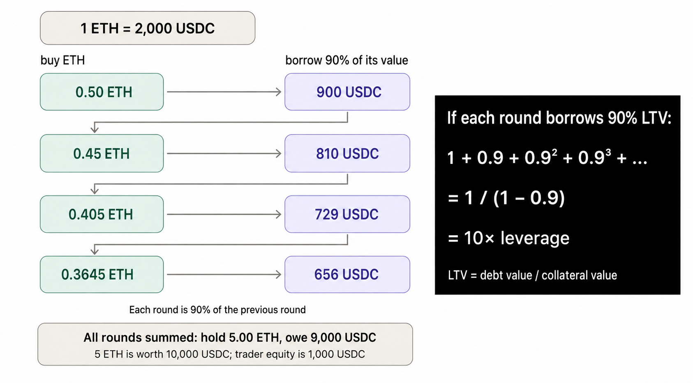
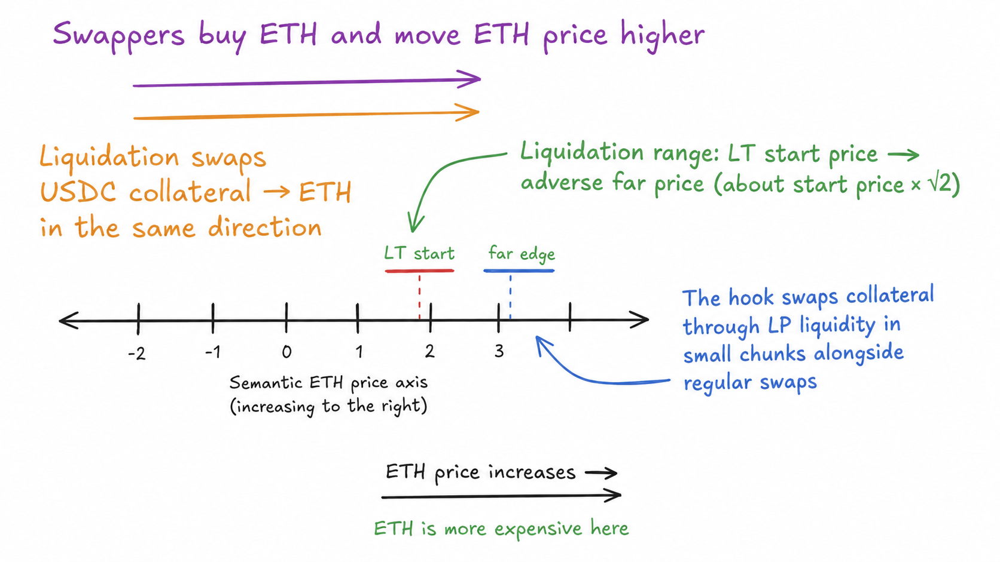

# TruePerp

**Oracleless + Keeperless 10x Leverage Perpetuals Protocol with AMM-native gradual liquidations.**

▶ **[Watch the TruePerp explainer video](https://youtu.be/F8zWRHL97Lc)**

TruePerp extends [TrueLend](https://github.com/queenleoa/TrueLend) into an expiry-free leveraged trading protocol. A
position holds real tokens and owes real token debt, while Uniswap v4 pool
activity triggers gradual liquidation instead of relying on an external price
feed and a privileged liquidation keeper.

The AMM is the price source, the execution venue, and the liquidation engine.
Normal swaps advance liquidation, while the permissionless `poke` function
keeps the same process moving when the pool is quiet.


## Why is this important?

Oracle dependence is one of DeFi's largest risk surfaces. An academic survey of
181 incidents recorded at least $3.24 billion in total DeFi losses and found
price-oracle attacks were the most frequent incident type in its dataset. An
external feed can also add latency and restrict a protocol to assets that the
feed already supports [1].

Liquidation is the second problem. Many lending and perpetual protocols wait
for a threshold and then unwind a large part of a position in one transaction.
A keeper is rewarded for selling collateral, often into the same volatile
market. In thin liquidity, that sale can push the price further, trigger more
liquidations, and create a liquidation spiral [2, 3].

TruePerp asks a different question:

> If the AMM already has the price, liquidity, and swap flow, why should
> liquidation be a separate keeper-run event?

The hook makes liquidation a process. Normal swaps move the pool tick. When
that tick crosses a position's risk boundary, the hook swaps only a bounded
chunk of collateral into the debt token and repays part of the loan. If the
price recovers, future chunks pause. If the price keeps moving against the
position, more chunks are processed over time.

This is the core idea inherited from TrueLend and applied to leveraged long and
short positions.

LPs provide the inventory for the liquidation work that keepers normally route
to an external market. The hook executes against that liquidity, LPs earn swap
fees plus the liquidation donation, and lending vaults receive the debt
repayment from every filled chunk.

## How TruePerp works

There are four parts:

1. **Trader:** supplies TrueUSDC margin and chooses long or short.
2. **Lending vault:** lends the other asset needed to create leverage.
3. **Uniswap v4 pool:** executes entry, exit, and liquidation swaps.
4. **TruePerp hook:** stores the position, watches risk ticks, gradually swaps
   collateral, repays debt, and routes liquidation charges to active LPs.

The opening happens atomically:

```text
margin + borrowed asset -> Uniswap swap -> held collateral + recorded debt
```

If any part of the borrow, swap, or health check fails, the whole transaction
reverts.

| Direction | What the position holds | What it owes | Adverse unwind |
|---|---|---|---|
| Long TrueETH | TrueETH | TrueUSDC | sell TrueETH for TrueUSDC |
| Short TrueETH | TrueUSDC | TrueETH | spend TrueUSDC to buy TrueETH |

The Uniswap LPs are counterparties to the actual swaps. The lending vaults are
the credit providers. There is no GMX-style shared pool that pays a trader's
marked profit.

## What is a physical perpetual?

“Physical” means the position is represented by real inventory and real debt
instead of a synthetic PnL number.

- A long already holds the base asset that creates its upside.
- A short holds the quote proceeds from selling borrowed base, which fund its
  gain if the base price falls.
- Closing converts the held asset as needed, repays the borrowed token, and
  returns the remainder to the trader.

The position has no practical scheduled expiry, so the exposure is perpetual.
There is no separate long-to-short funding payment because the product has no
independent synthetic perp price. A production version can charge ordinary
borrow interest to pay lenders.

The current hackathon vaults charge **zero interest**. This keeps debt fixed
while v0 uses fixed liquidation ticks. The next version adds lender yield and
moves each position's risk ticks as borrow interest grows.

## Why 10x leverage is possible

Two definitions are enough:

```text
LTV = debt value / collateral value
LT  = the LTV at which gradual liquidation starts
```

A higher safe liquidation threshold allows a position to begin with a higher
LTV. That creates more exposure from the same trader margin.

Recursive borrowing is the easiest way to see the intuition. If each round can
borrow a fraction `r` of the new collateral, total long exposure approaches the
geometric series:

```text
1 + r + r² + r³ + ... = 1 / (1 - r)
```

At 90% LTV, the frictionless result is `1 / (1 - 0.90) = 10x`. At 94% LTV it is
about `16.7x`.



*At 90% LTV, repeated borrowing converges to 10x long exposure. The TruePerp
router creates the same final balance with one atomic borrow and swap.*

### Why some TrueLend material says “up to 17x”

The inherited TrueLend hook can be configured with a 99% LT. Its 95% opening
headroom then permits about 94.05% opening LTV, which corresponds to about
16.8x frictionless long exposure.

Together, the TruePerp and TrueLend parameter sets show the 10–17x leverage
design space. The deployed TruePerp market uses the 10x profile.

The deployed TruePerp parameters are:

```text
maximum LT          = 95%
opening headroom    = 95% of LT
maximum opening LTV = 95% × 95% = 90.25%
```

That gives a theoretical maximum of 10.26x for a long and 9.26x directional
exposure for a short before swap fees and price impact. The product therefore
supports **up to 10x leverage**. The UI accounts for the actual Uniswap output
when it builds the final on-chain position.

The short formula differs because its directional exposure is the borrowed
base asset rather than the full quote collateral:

```text
long leverage  = 1 / (1 - LTV)
short leverage = LTV / (1 - LTV)
```

## Tick-driven gradual liquidation

A position registers a soft-liquidation start tick derived from its LT and a
far tick deeper in the adverse direction. The current profile uses a configured
3,466-tick width, approximately a √2 price span. In economic base/quote terms,
that means roughly:

- long: from the LT price down toward `LT price / √2`;
- short: from the LT price up toward `LT price × √2`.

The actual boundaries are ticks rounded for the pool's direction and tick
spacing; LT itself is a percentage, not a tick.



*Short liquidation follows the same direction as ordinary ETH buying. The hook
swaps USDC collateral into ETH through LP liquidity in small chunks.*

When a position is inside its range:

1. The hook chooses a small collateral input using time, range depth, position
   size, and a liquidity-based cap.
2. It swaps that collateral through the same Uniswap pool.
3. A caller reward is carved out when the permissionless fallback is used.
4. If active liquidity exists after the swap, part of the remaining
   liquidation charge is donated to those LPs.
5. Net output repays the correct lending vault.
6. A successfully filled chunk reduces collateral and debt.

If price returns through the safe boundary, future selling pauses and the
trader keeps the remaining exposure. Completed chunks remain settled. At the
far edge, a slippage-bounded `forceClose` becomes the terminal backstop.

## The three hook callbacks

TruePerp inherits the same three core Uniswap v4 callbacks from TrueLend:

### `afterInitialize`

Deploys one isolated lending vault for each pool token, enables the pool in the
hook, installs the default risk settings, and starts the first pool-price
observation. The owner later applies the TruePerp term and LT policy, and the
router separately activates the canonical market.

### `beforeSwap`

Feeds the **pre-swap** tick into the pool-local observation system. This stops a
single swap from writing its own final price and immediately treating that
price as trusted history. Observations are committed at most once every 60
seconds, with interim extremes retained. This guards the admission price
against one-transaction manipulation.

### `afterSwap`

Checks the ticks crossed by the user's swap and updates affected positions. It
then processes at most two due chunks from the active queue, including
positions activated by earlier swaps. Each filled chunk swaps collateral,
accounts for the liquidation charge, repays debt, and routes the LP share to
active final-tick liquidity. A permissionless `poke` uses the same engine with
a larger limit of ten chunks when organic swaps are quiet.

So regular LP liquidity and swap flow absorb most of the work normally assigned
to a keeper. No privileged liquidator receives the whole position or chooses an
off-protocol execution venue.

## Who benefits?

- **Traders** get expiry-free long or short exposure with a gradual primary
  liquidation path instead of an immediate full close.
- **LPs** keep normal swap fees and receive liquidation-charge donations when
  they are active after a chunk.
- **Lenders** gain a new source of borrow demand from leveraged traders. V0
  isolates the liquidation mechanism with protocol-seeded, zero-rate vaults;
  dynamic lender interest is the next extension.

Earlier, smaller liquidations create the runway for higher LTs on liquid,
lower-risk pairs. This turns the same TrueLend mechanism into a higher-leverage
trading product.

## What can a TruePerp pool trade?

One pool supports one base exposure. The TrueETH/TrueUSDC pool trades TrueETH.
BTC, SOL, or another asset gets its own market.

A new underlying needs its own liquid base/quote pool, two debt vaults, risk
settings, and enough independent arbitrage to keep its AMM price aligned.
Removing the external oracle expands the set of markets that can be built
directly from AMM liquidity.

The deployed demo uses capped **TrueETH (`tETH`)** and **TrueUSDC (`tUSDC`)**.
They reproduce the decimal behavior of ETH and USDC for testnet interaction.
Their price comes entirely from the demo pool.

## Live hackathon demo

The complete demo is deployed on **Unichain Sepolia (chain ID 1301)**. Public
addresses and transaction hashes are recorded in
[`deployments/unichain-sepolia.json`](deployments/unichain-sepolia.json).

The frontend contains:

- a simulated trading chart;
- long/short selection and a leverage slider;
- a plain-language collateral, debt, equity, LTV, and LT explanation;
- one-claim tETH and tUSDC faucets; and
- a gasless signature flow that relays 0.05 native test ETH to a new wallet.

Run it locally:

```bash
cd frontend
npm ci
npm test
npm run dev
```

Then connect MetaMask, switch to Unichain Sepolia, sign for gas ETH, claim the
two demo tokens, choose a direction and leverage, and open the position. See
the [frontend guide](frontend/README.md) for the complete judge walkthrough and
hosting instructions.

## Repository map

| Component | Job |
|---|---|
| [`TruePerpRouter`](src/TruePerpRouter.sol) | turns margin and a borrowed amount into an atomic physical long or short |
| [`TruePerpHook`](src/TruePerpHook.sol) | owns positions and inherits the tick-driven liquidation engine |
| [`PerpLendingVaultFactory`](src/PerpLendingVaultFactory.sol) | creates the two zero-rate demo debt vaults |
| [`LendingVault`](lib/truelend/src/LendingVault.sol) | records debt shares, repayments, utilization, and losses |
| [`TrueDemoTokens`](src/mocks/TrueDemoTokens.sol) | capped tETH and tUSDC test assets |
| [`NativeGasFaucet`](src/mocks/NativeGasFaucet.sol) | sends one relayed 0.05 test-ETH allocation per address |
| [`frontend`](frontend/README.md) | interactive trading and leverage explanation |

The supporting documents separate the concept from the implementation details:

- [WHITEPAPER.md](WHITEPAPER.md): formal proposal and equations;
- [DESIGN.md](DESIGN.md): contracts, state transitions, and accounting;
- [PARAMETERS.md](PARAMETERS.md): formulas and parameter choices;
- [RESEARCH.md](RESEARCH.md): alternatives, risks, and experiments; and
- [DEPLOYMENT.md](DEPLOYMENT.md): live deployment and demo operations.

## Hackathon scope

The deployed MVP focuses on the complete mechanism:

- one tETH/tUSDC market with up to 10x long exposure;
- atomic physical long and short entry;
- pool-derived admission pricing;
- swap-driven gradual liquidation;
- permissionless `poke` and terminal `forceClose` paths;
- LP donation and debt repayment accounting;
- protocol-seeded, zero-rate debt vaults; and
- a live frontend for faucets, quoting, approvals, and position opening.

The next version adds dynamic interest-bearing debt, exclusive router entry,
liquidation-capacity-aware admission, deeper trigger queues, local price limits
for ordinary chunks, and position closing in the frontend.

## Build and test

```bash
git clone --recursive https://github.com/queenleoa/TruePerp.git
cd TruePerp
forge build
forge test --offline
forge test --root lib/truelend --offline
```

Current verification:

- 45 TruePerp root tests;
- 94 inherited TrueLend tests; and
- 25 frontend tests plus a successful production build.

## References

1. Zhou et al., [*SoK: Decentralized Finance (DeFi) Attacks*](https://arxiv.org/abs/2208.13035).
2. Qin et al., [*An Empirical Study of DeFi Liquidations: Incentives, Risks, and Instabilities*](https://arxiv.org/abs/2106.06389).
3. Warmuz et al., [*Toxic Liquidation Spirals*](https://arxiv.org/abs/2212.07306).
4. Adams et al., [*Uniswap v4 Core*](https://app.uniswap.org/whitepaper-v4.pdf).
5. [TrueLend](https://github.com/queenleoa/TrueLend), the underlying AMM-native gradual-liquidation lending hook.
