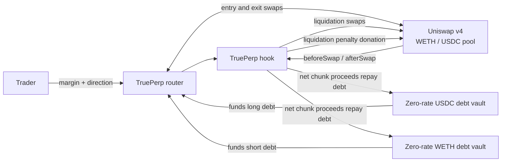

# TruePerp

**Expiry-free leveraged long and short positions with keeperless, gradual
liquidation on Uniswap v4.**


TruePerp represents leverage with real assets and real debt. A position is not
an unbacked cash promise against a house vault:

- an ETH long holds WETH and owes USDC;
- an ETH short holds USDC and owes WETH; and
- when either position becomes unsafe, the hook converts its collateral into
  its debt asset through the ETH/USDC pool in small, paced swaps.

The demo accepts USDC margin for either direction. A long swaps that margin and
its borrowed USDC into WETH; a short adds the USDC received from selling
borrowed WETH to its margin.

Ordinary pool activity drives that process. The swap that moves the pool into a
position's liquidation range calls the hook, and the hook can execute a bounded
liquidation chunk before the transaction finishes. If price exits the registered
range on its safe side, future chunks pause; a later adverse crossing resumes
them. A permissionless, rewarded `poke` provides a fallback for quiet markets;
no privileged keeper receives the position or chooses its execution price.

This repository is a hackathon research prototype. It is intended to make the
mechanism concrete and testable, not to hold production funds.

## Architecture at a glance



The hook is the liquidation engine. The two lending vaults only fund debt legs:
the USDC vault lends to longs and the WETH vault lends to shorts. Uniswap LPs
are the immediate counterparties to every real trade and earn ordinary swap
fees plus liquidation-penalty donations. The relevant debt vault's support
capital bears any residual bad debt after position collateral is exhausted.

In v0 that support capital is protocol-seeded and the two debt vaults charge a
zero borrow rate. This is a deliberate mechanism-isolation choice, not a claim
that production leverage can be financed for free: keeping debt principal fixed
also keeps the registered liquidation ticks valid. Adding carry requires
debt-aware trigger re-registration as the borrow index changes.

There is no separate GMX-style pool that pays marked trader profit. A profitable
position is paid by the inventory it already holds: appreciated WETH for a long,
or the USDC proceeds retained after borrowed WETH was sold for a short.

## What does ETH/USDC trade?

An ETH/USDC market supports **ETH exposure only**.

| Direction | Position holds | Position owes | Adverse liquidation trade |
|---|---|---|---|
| Long ETH | WETH | USDC | sell WETH for USDC |
| Short ETH | USDC | WETH | buy WETH with USDC |

The pair cannot price or settle a BTC, SOL, equity, or arbitrary-index position.
A different underlying requires its own liquid base/quote pool and debt vaults.
This restriction is a direct consequence of removing the external oracle: the
same venue that defines the price must also execute the position's conversions.

## Why this is a perpetual-margin product

Positions have no practical scheduled expiry: the inherited compact layout uses
the maximum 32-bit term, approximately 136 years. The shipped v0 debt rate is
zero, so principal does not drift away from the fixed liquidation range. This is
an inventory-backed perpetual-margin construction rather than a cash-settled
futures exchange.

For a long holding `B` WETH with `Dq` USDC debt at ETH price `P`, equity in USDC
is

```text
long equity = P * B - Dq
```

For a short holding `Cq` USDC with `Db` WETH debt,

```text
short equity = Cq - P * Db
```

That physical representation matters. An uncapped synthetic ETH long creates
an unbounded USDC liability for its counterparty as ETH rises. Here the long
already holds WETH, so the asset that creates the profit also funds it. A short
retains the proceeds from selling borrowed WETH, which fund its profit if ETH
falls. The remaining tail is ordinary collateralized-credit risk, with an
explicit support-capital loss path, rather than an unfunded winner claim.

## Keeperless gradual liquidation

TruePerp carries over TrueLend's central mechanism rather than merely borrowing
its chunk-size formulas.

1. A position registers the ticks at which its loan-to-value ratio enters and
   leaves a liquidation range.
2. Every ordinary pool swap records a pre-swap observation and calls the hook
   again after execution.
3. When a boundary is crossed, the hook places the position in a bounded queue.
4. While the pool tick remains inside that registered range and a chunk is due,
   the hook makes an actual exact-input swap through the same pool.
5. A portion of the output is donated to active Uniswap LPs; the remainder
   repays the appropriate debt vault.
6. Each chunk reduces both collateral and debt. Processing pauses only when the
   tick exits on the safe side and resumes on a later adverse crossing.
7. If ordinary swaps stop, anyone may call `poke`; its reward is carved from the
   same liquidation penalty.

The process is pausable, not literally reversible: completed swaps remain
completed, but a safe-side range exit preserves the exposure that has not yet
been sold. Liquidation can still affect spot price. TruePerp's claim is that the
collateral input of each chunk is time-paced and capped against current depth,
not that real liquidation can be made impact-free.

## Who is the counterparty?

“Counterparty” has two distinct meanings here:

| Role | Party | Obligation |
|---|---|---|
| Trade counterparty | In-range Uniswap LPs | exchange WETH and USDC at the pool curve |
| Credit provider | protocol-seeded USDC or WETH vault | lend the debt asset and absorb residual bad debt |
| Automation | `TruePerpHook` | detect risk, pace chunks, swap, donate, and repay |
| Position owner | Trader | supplies first-loss equity and receives the residual on close |

The Uniswap pool is therefore central to liquidation, but its LPs are not
silently debited for arbitrary marked PnL. They take the other side of actual
swaps under the pool invariant. In the shipped v0, debt-vault support capital is
protocol-seeded, accepts the isolated credit risk, and earns no interest.

## Why not a physically hedged counterparty vault?

A dual-asset counterparty vault could issue synthetic positions and hedge them
in the spot pool. To back one long it would have to buy and reserve WETH; to
back one short it would have to borrow or sell WETH and reserve the USDC
proceeds. Liquidation would then unwind those hedges.

That construction adds hedge timing, rebalance, basis, withdrawal, and share-NAV
risk. Once every synthetic unit is exactly hedged, it also converges to the
simpler representation above: a long is WETH collateral plus USDC debt, and a
short is USDC collateral plus WETH debt. TruePerp stores that physical position
directly instead of maintaining a second derivative ledger that can diverge
from its hedge.

## Hackathon scope

The demo deliberately targets one curated WETH/USDC market:

- one hook-enabled Uniswap v4 pool with protocol-seeded wide-range liquidity;
- one isolated USDC lending vault and one isolated WETH lending vault;
- demo-selected three-to-five-times leverage, not a contract-enforced maximum;
- actual swap execution for entry, exit, and liquidation;
- caller-supplied deadlines and price limits;
- a truncated pool-local observation history for manipulation-resistant
  admission checks;
- depth-capped collateral inputs for time-paced liquidation chunks, with a small
  LP donation;
- permissionless `poke` and a slippage-bounded terminal backstop; and
- isolated bad-debt accounting against the vault that originated the debt.

This scope demonstrates the research contribution cleanly: **market activity
itself advances a gradual liquidation that exchanges real inventory, repays
real debt, and rewards the LPs absorbing the flow.**

## Repository map

| Component | Purpose |
|---|---|
| [`TruePerpHook`](src/TruePerpHook.sol) | position custody, pool observations, risk ranges, queue processing, swaps, and repayment |
| [`PerpLendingVaultFactory`](src/PerpLendingVaultFactory.sol) | deploys the two zero-rate, utilization-capped support vaults used by v0 |
| [`LendingVault`](lib/truelend/src/LendingVault.sol) | debt-share and loss accounting, instantiated once for USDC and once for WETH |
| [`TruePerpRouter`](src/TruePerpRouter.sol) | atomic quote-margin entry and physical exit with user price protection |
| TrueLend libraries | tick indexing, truncated observations, range math, and chunk sizing |

See [DESIGN.md](DESIGN.md) for the full state machine and accounting model.
The research, parameter, and whitepaper documents are being aligned to this
physical architecture as part of the same prototype revision.

```bash
git clone --recursive https://github.com/queenleoa/TruePerp.git
cd TruePerp
forge build
forge test --offline
```

## Status

The canonical TruePerp path is `TruePerpRouter`: it assigns base/quote semantics,
requires an activated market, and constructs quote-margin longs and shorts.
Because v0 directly inherits the TrueLend kernel, the lower-level
`TruePerpHook.open` entrypoint remains publicly reachable. Direct callers can
bypass the router's product checks, including on the activated pool. Pools that
use the hook but are not router-activated have their own isolated vaults, but
they are not canonical TruePerp markets. This is an explicit prototype
limitation, not a security boundary.

The root suite currently contains 14 TruePerp integration tests; the inherited
TrueLend engine has 94 tests in its own project. Both suites must be run when the
kernel changes. TruePerp remains a research prototype and has not been
externally audited.
