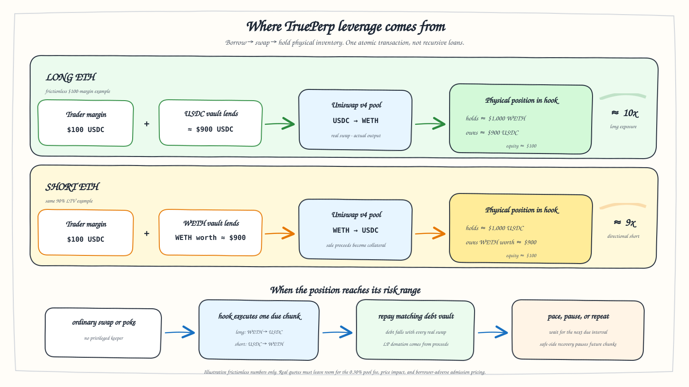

# TruePerp: AMM-Native Perpetual Margin with Gradual Physical Liquidation

**Research paper · September 2026**

## Abstract

TruePerp is an expiry-free leveraged-trading protocol built around a Uniswap v4
pool and its hook lifecycle. **Its primary product feature is up to 10x ETH
leverage under the recommended WETH/USDC major-asset risk profile.** An ETH long
holds WETH and owes USDC; an ETH short holds USDC and owes WETH. Entry, exit,
and liquidation therefore exchange real inventory through the associated
WETH/USDC pool. There is no synthetic cash-settled claim against a shared
counterparty pool, no fixed maturity, and no zero-sum funding payment between
long and short traders. The v0 debt vaults
deliberately charge zero interest: they are protocol-seeded support capital for
the mechanism demonstration, not yield products.

The protocol's principal contribution is an AMM-native liquidation process.
Ordinary swaps update a pool-local price history, cross position-specific risk
ticks, and give the hook an opportunity to execute a bounded liquidation swap
before the transaction completes. A distressed position is converted from its
held asset into its debt asset in time-paced, input-capped chunks. Every chunk
repays debt. If price recovers, future chunks pause; if the pool becomes quiet,
a permissionless `poke` runs the same state machine; and if gradual treatment is
exhausted, a slippage-bounded `forceClose` provides the terminal path.

This construction delivers economically perpetual long and short exposure, but
it is not a conventional perpetual-futures contract. It is more precisely an
isolated, physically executed margin product with no expiry. Lending vaults are
necessary credit infrastructure; the hook's integration of risk detection,
execution, and repayment with the AMM is the research contribution. The
checked-in implementation runs this design end to end on a live Uniswap v4
testnet market.

*Figure 1. The router constructs physical exposure, the hook owns the risk
state machine, the WETH/USDC pool prices and executes every conversion, and the
isolated vaults provide debt rather than marked-PnL backing.*

## 1. Instrument definition

### 1.1 One pool, one base exposure

Let the market price be

$$
P=\frac{\text{USDC}}{\text{WETH}}.
$$

A WETH/USDC TruePerp market supports WETH exposure only. It cannot use that
pool to trade BTC, SOL, an equity, or an unrelated index. Removing an external
oracle makes this restriction structural: the same venue that supplies the
price must also execute the position's asset conversions.

The two directions are physical mirror images:

| Direction | Held by the position | Owed to a lending vault | Liquidation conversion |
|---|---|---|---|
| Long WETH | WETH | USDC | sell WETH for USDC |
| Short WETH | USDC | WETH | spend USDC to buy WETH |

For a long holding $C_b$ WETH with outstanding quote debt $D_q$ USDC, marked equity
in USDC is

$$
Q_L(P)=PC_b-D_q.
$$

For a short holding $C_q$ USDC with outstanding base debt $D_b$ WETH, marked equity
is

$$
Q_S(P)=C_q-PD_b.
$$

The long's positive price exposure is carried by WETH already in custody. The
short's gain when WETH falls is the USDC left after repurchasing its WETH debt.
Neither result requires an unbounded payout from a counterparty vault.

### 1.2 Why the product is called perpetual

The positions have no practical fixed expiry. They may remain open while their
collateral ratios remain acceptable; elapsed time alone does not increase v0
debt. This is the economically relevant sense in which the exposure is
perpetual.

The term must not obscure the distinction from a standard perpetual swap.
TruePerp has no separate derivative mark, no periodic transfer between matched
longs and shorts, and no shared marked-profit obligation. Its closest conventional
category is isolated leveraged spot or margin financing. The protocol retains
the TruePerp name because it offers continuous long and short exposure and an
automated maintenance process, not because its balance sheet is identical to a
futures exchange.

### 1.3 Leverage envelope

Leverage is the central product capability. Let $\ell$ denote the opening LTV,
defined as debt value divided by held-collateral value. Directional leverage is

$$
\lambda_L=\frac{1}{1-\ell_L},
\qquad
\lambda_S=\frac{\ell_S}{1-\ell_S}.
$$

The long and short expressions differ because a long's base inventory includes
both margin-financed and debt-financed WETH. A short's directional ETH exposure
is only the borrowed WETH; its USDC collateral also contains the sale proceeds.

The recommended WETH/USDC configuration treats ETH as a major asset and sets
the soft-liquidation threshold to $\mathrm{LT}=95\%$. The inherited opening
headroom is $h_o=95\%$, hence

$$
\ell_{max}=h_o\mathrm{LT}=0.95(0.95)=90.25\%.
$$

This produces the following frictionless, post-trade limits:

| Direction | Maximum directional leverage | Product presentation |
|---|---:|---|
| Long WETH | $1/(1-0.9025)=10.26\times$ | up to 10x |
| Short WETH | $0.9025/(1-0.9025)=9.26\times$ | up to approximately 9x |

At the maximum opening LTV, the soft boundary lies about 5% below the opening
price for a long and 5.26% above it for a short:

$$
\frac{P_{L,\mathrm{LT}}}{P_0}=\frac{0.9025}{0.95}=0.95,
\qquad
\frac{P_{S,\mathrm{LT}}}{P_0}=\frac{0.95}{0.9025}=1.0526.
$$

This narrow runway is why the design couples high leverage to early,
time-paced deleveraging rather than presenting leverage independently of its
liquidation mechanism.

The canonical `TruePerpRouter.openPosition` path rejects any requested LT above
95%, even if an administrator raises the inherited generic hook configuration.
The inherited direct hook entry remains an open bypass, discussed in
Section 9.

The phrase **up to 10x ETH leverage** is therefore a market-level headline,
not a statement that both directions have an identical algebraic maximum. It
also does not guarantee that a deposit can obtain the frictionless notional:
the route records actual pool output and admission uses a borrower-adverse
price, so swap fees and impact reduce the execution-safe request. Vault cash,
the hard utilization ceiling, and route price bounds constrain absolute
position size separately.

*Figure 2. Frictionless examples expose the long/short leverage asymmetry. The
transaction records actual swap output, so executable requests must leave a
buffer for fees, impact, and admission pricing.*

## 2. System architecture

### 2.1 The Uniswap pool

The hook-enabled WETH/USDC pool performs three jobs:

1. It executes every entry, exit, and liquidation conversion.
2. Its tick and observation history provide the market's native risk reference.
3. Ordinary swaps provide the event clock that advances liquidation work.

Uniswap LPs are counterparties to actual swaps under the pool invariant. They
earn ordinary swap fees and may receive a configured donation from liquidation
proceeds. They are not debited for a trader's marked profit.

### 2.2 The hook

`TruePerpHook` owns the position state machine. It records collateral and debt
shares, maintains a truncated pool-local observation history, indexes
liquidation boundaries by tick, executes collateral-to-debt swaps, donates the
liquidation charge, and routes net output to debt repayment.

The hook is the protocol-specific innovation. A lending vault can exist without
TruePerp; it does not by itself turn spot activity into gradual liquidation. The
novel composition is that pool state both identifies risk and supplies the
execution path, while v4 callbacks make ordinary market activity advance a
bounded liquidation engine.

### 2.3 The lending vaults

Each market uses two isolated credit pools:

- a USDC vault lends quote debt to WETH longs; and
- a WETH vault lends base debt to WETH shorts.

Vault shares represent claims on lender-owned cash plus performing debt. In v0,
`PerpLendingVaultFactory` deploys both vaults with base rate, both slopes,
reserve factor, and rate ceiling all equal to zero. The demo therefore expects
the protocol to seed the capital; depositors earn no borrow yield. This capital
still faces collateral-shortfall risk, and the inherited utilization,
withdrawal-liquidity, debt-share, and write-off rules remain active. Those rules
are supporting lending infrastructure rather than the defining perpetual
mechanism.

### 2.4 The router

A router gives the physical core a margin-trading interface. In one PoolManager
unlock, it can obtain the debt asset, swap it into the collateral asset, open the
collateral-and-debt position for the trader, and settle the temporary balance
with funds borrowed from the appropriate vault. The reverse route repays debt,
converts only the collateral needed for repayment, and returns the residual.
Every route includes a deadline and a user-specified price or amount bound.

The atomic route changes convenience, not solvency. After entry, the long still
holds WETH and owes USDC; the short still holds USDC and owes WETH.

This is the atomic form of TrueLend's recommended leverage loop: supply margin,
borrow the opposite asset, swap into the held asset, and deposit the complete
result as one collateralized position. PoolManager flash accounting compresses
those operations into one unlock. It does not leave a series of recursively
nested loans, and failure of any swap, admission, or settlement step reverts the
complete opening.

The router also exposes current position metrics for interfaces: collateral and
debt value in quote units, equity, LTV, directional notional, and directional
leverage. These values are marked at current pool spot and are informational;
the hook continues to use its borrower-adverse observation rule for admission.

## 3. Origination and voluntary close

### 3.1 Long entry

Suppose a trader contributes quote margin $M_q$ and the USDC vault lends $D_q$.
The router swaps the complete $M_q+D_q$ USDC input through the designated pool.
If the actual output after fees and price impact is $C_b$ WETH, then

$$
\text{held collateral}=C_b, \qquad \text{debt}=D_q.
$$

The opening check values $C_b$ conservatively using the worse of the current
tick and the pool-local filtered observation. It must include the debt created
by the transaction and cannot value newly purchased WETH at a price made
favorable by its own swap.

Ignoring execution cost, a requested long leverage $\lambda_L$ maps to

$$
D_q=(\lambda_L-1)M_q.
$$

Thus a 5x long uses approximately four units of USDC debt per unit of margin; a
nominal 10x long uses approximately nine. A production quote function must
solve against actual AMM output rather than submit this frictionless estimate
at the admission boundary.

### 3.2 Short entry

For a short, the trader contributes USDC margin $M_q$ and borrows $D_b$ WETH.
The WETH is sold into the designated pool for $Q_{sale}$ USDC:

$$
C_q=M_q+Q_{sale}, \qquad \text{debt}=D_b.
$$

Again, admission uses a conservative post-route health check. The realized AMM
output, not an idealized oracle quote, determines the recorded collateral.

Ignoring execution cost, a requested short leverage $\lambda_S$ borrows base
whose quote value is

$$
P D_b=\lambda_S M_q.
$$

A 5x short therefore borrows five units of WETH value per unit of margin. This
is not the same borrow ratio as a 5x long.

### 3.3 Close

A long closes by selling enough held WETH to repay outstanding USDC debt. A short
closes by spending enough held USDC to buy and repay outstanding WETH debt. A trader
may alternatively repay the borrowed token externally and withdraw the held
asset. Any remaining collateral belongs to the trader after debt, pool fees,
and declared protocol charges are satisfied.

There is no separate PnL payment. Profit or loss is the residual inventory after
the real debt is extinguished.

## 4. Zero-carry debt and price anchoring

The inherited vault represents debt with shares $s_i$ and a WAD-scaled borrow
index $I_a$, where $W=10^{18}$:

$$
D_i=\frac{s_iI_a}{W}.
$$

`PerpLendingVaultFactory` sets every rate input and the rate ceiling to zero.
Consequently,

$$
I_a(t+\Delta t)=I_a(t)=W,
\qquad
D_i=s_i
$$

apart from debt retired by repayment or write-off. Time and utilization do not
increase v0 debt, no interest reserve accrues, and neither USDC nor WETH vault
capital earns carry.

This omission does not leave a synthetic perpetual mark unanchored. A
conventional cash-settled perpetual often uses funding to pull its derivative
price toward an external spot index. TruePerp has no separate derivative price:
the position is actual WETH and USDC inventory, and entry, exit, and liquidation
settle through the WETH/USDC spot pool itself. External-market arbitrage, not a
long-short funding transfer, anchors that pool.

Zero carry is a deliberate v0 scope choice. The registered liquidation range is
computed once from opening debt. Keeping debt constant means elapsed time cannot
make that range stale before any price tick is crossed. A production design may
charge asset-specific borrow interest, but it must first add atomic, dynamic,
debt-aware trigger re-registration and test its liveness and gas bounds. That
extension is future work, not a current protocol claim.

## 5. Risk geometry

Define the two loan-to-value ratios

$$
\ell_L(P)=\frac{D_q}{PC_b},
\qquad
\ell_S(P)=\frac{PD_b}{C_q}.
$$

Let $\theta$ be the soft-liquidation threshold, with

$$
0<\theta<1.
$$

Let $D_{q,0}$ and $D_{b,0}$ be opening principal. The compact demo fixes its tick
range at origination. Ignoring execution costs, the soft-liquidation and
opening-principal zero-equity prices are

$$
P_{L,\theta}=\frac{D_{q,0}}{\theta C_b},
\qquad
P_{L,bk}=\frac{D_{q,0}}{C_b}
$$

for a long, and

$$
P_{S,\theta}=\frac{\theta C_q}{D_{b,0}},
\qquad
P_{S,bk}=\frac{C_q}{D_{b,0}}
$$

for a short. A long enters danger as price falls; a short enters danger as price
rises. The demo places a fixed far tick a configured width deeper in the adverse
direction. That geometric edge is not itself a solvency guarantee; a separate
live coverage test can enable force-close earlier when price, prior execution,
and liquidation charges consume the remaining runway.

The corresponding price boundaries are converted into initialized Uniswap
ticks with explicit token orientation and decimal normalization. Rounding is
conservative: the soft boundary must activate no later than the mathematical
threshold. The coverage backstop uses the position's actual remaining
collateral and debt. Debt does not grow with time in v0, and the stored ticks do
not move after repayments.

## 6. Gradual, pool-executed liquidation

### 6.1 State transition

When an ordinary swap moves the pool tick across a registered soft boundary,
the hook marks the position active for liquidation. It does not transfer the
position to a keeper. Instead, when the cadence permits, it converts a bounded
amount of the position's held asset into its debt asset through the same pool.

For a long, let an exact-input sale consume $x_b$ WETH and return $y_q$ USDC.
Let $z_q$ be the total liquidation charge and $r_q\le z_q$ the caller portion;
the pool donation is $z_q-r_q$. Repayment is

$$
u_q=\min(D_q,y_q-z_q),
$$

and the new state is

$$
C_b'=C_b-x_b, \qquad D_q'=D_q-u_q.
$$

For a short, an exact-input swap spends $x_q$ USDC and obtains $y_b$ WETH. With
total charge $z_b$ and caller portion $r_b\le z_b$ in the output asset,

$$
u_b=\min(D_b,y_b-z_b),
$$

$$
C_q'=C_q-x_q, \qquad D_b'=D_b-u_b.
$$

Thus every successful chunk retires debt. If debt reaches zero, unused output
and all unsold collateral are returned to the trader. If no executable pool
liquidity exists, the chunk consumes nothing and remains pending.

### 6.2 Execution loss

At the reference price $P$, a long chunk changes equity by

$$
Q_L'-Q_L=-(Px_b-u_q),
$$

and a short chunk changes equity by

$$
Q_S'-Q_S=-(x_q-Pu_b).
$$

The bracketed terms are execution drag: pool price impact, swap fees,
liquidation donation, and caller reward. In the frictionless limit they are
zero, so reducing collateral and debt by equal value preserves equity while
improving LTV. In reality liquidation is not impact-free. The v0 implementation bounds
requested input using a coarse liquidity proxy; it does not place a local
sqrt-price limit on ordinary chunks. Its safety therefore depends on starting
early enough and empirically calibrating that proxy against actual execution.

### 6.3 Pacing

The desired input is a fraction of remaining collateral, increased by elapsed
time and depth into the risk range, then bounded by a range-depth proxy:

$$
x=\min\!\left(
\frac{C}{N}\,g(\Delta t,d,\varrho),
\eta D_{range},
C
\right).
$$

Here $N$ is the target number of chunks, $d\in[0,1]$ is range depth,
$\varrho$ measures position pressure relative to the proxy, $\eta$ is the
per-chunk input fraction, and $D_{range}$ is measured in the held token. The
current kernel estimates $D_{range}$ by extending current active liquidity over
the position's whole range; it does not traverse initialized ticks and therefore
is neither guaranteed executable depth nor a price-impact bound. Time catch-up
and per-callback work are capped. This makes requested input gradual; it does
not guarantee execution through a gap or an empty pool.

### 6.4 Callback path

The hook uses the v4 lifecycle as follows:

1. `beforeSwap` records the pre-swap tick when the observation interval permits.
2. The user's ordinary swap executes.
3. `afterSwap` walks only crossed registered boundaries, refreshes affected
   positions, and processes at most a configured number of due chunks.
4. A chunk calls the PoolManager's swap function directly in the already-open
   accounting context. The vendored v4-core
   `lib/truelend/lib/v4-periphery/lib/v4-core/src/libraries/Hooks.sol`
   implementation skips `beforeSwap` and `afterSwap` when the hook itself
   initiated the swap, so the liquidation swap does not recursively invoke
   these callbacks.
5. The hook settles its input, takes the output, donates the declared penalty,
   and repays the correct lending vault.

All loops and trigger walks require hard bounds and resumable cursors. Ordinary
swappers must not inherit unbounded work from the number of open positions.

### 6.5 Poke and recovery

`poke(pool)` is a permissionless liveness path. It enters a PoolManager
accounting context and invokes the same trigger walk and chunk engine with a
bounded, possibly larger work allowance. Its caller reward is carved from the
position's liquidation charge; it is not newly minted and cannot exceed
realized proceeds.

If price reverses across the stored soft boundary, the hook pauses future
chunks. Already executed swaps, fees, donations, and repayments are final. The
position retains its remaining exposure and can re-enter liquidation on a later
adverse crossing. The demo does not dynamically relocate the range after each
repayment. This is pausable gradual deleveraging, not reversible execution.

## 7. Terminal force-close and loss allocation

Gradual treatment ends when the pool passes the far boundary, the current
collateral-and-debt state breaches conservative buffered coverage, or the
finite implementation horizon is reached. For collateral value $V_D$ in
debt-token units—$PC_b$ for a long and $C_q/P$ for a short—and configured
buffer $b$,

$$
V_D(1-b_{eff})<D,
\qquad
b_{eff}=\min\!\left(b,\frac{1-\theta}{2}\right)
$$

makes the position eligible. Anyone may then call `forceClose(position)`. The
product has no scheduled maturity; the inherited
compact position layout represents that policy with a maximum 32-bit horizon
(about 136 years), which is a finite implementation sentinel rather than a
practical trading expiry. Its observation timestamps use a separate 32-bit
clock that wraps in 2106, so the implementation would require migration long
before the nominal position horizon.

The backstop attempts to convert remaining collateral into the debt asset, but
uses a hard sqrt-price limit. If the limit or the edge of available liquidity is
reached, only the executable portion fills. Unsold collateral remains in the
position, which stays force-closeable for later retry. This is intentionally not
an unbounded fire sale.

The declared liquidation charge is taken from gross swap output before net
repayment; its caller-reward and LP-donation portions are therefore senior to
the debt claim for that execution. Net output then repays debt. If the debt is
cleared, surplus output and remaining collateral return to the trader. If all
collateral is consumed and debt remains, the borrowed-asset vault records bad
debt. The v0 loss waterfall is:

1. position collateral and accrued proceeds;
2. any inherited-vault reserve balance, which v0 neither seeds nor grows; and
3. the protocol-seeded lending-vault share capital.

Uniswap LPs experience only the inventory and price effects of swaps they
actually execute. They do not absorb an off-ledger shortfall. The corresponding
protocol-seeded debt vault absorbs the credit tail.

## 8. Economic interpretation

| Property | Conventional cash-settled perpetual | TruePerp physical perpetual margin |
|---|---|---|
| Position representation | derivative PnL ledger | held asset plus opposing-asset debt |
| Leverage envelope | venue-specific | up to 10x ETH under the recommended major-asset profile; direction-specific limits apply |
| Long profit source | losing traders, market maker, or insurance fund | appreciated base inventory |
| Short profit source | losing traders, market maker, or insurance fund | retained quote after repurchasing base debt |
| Carry | usually long-short funding | zero in v0; no synthetic funding ledger |
| Expiry | none | no practical scheduled expiry; finite v0 sentinels |
| Entry and exit | book, AMM, or oracle accounting | actual swaps in the designated AMM |
| Liquidation | position transfer or event close | paced collateral-to-debt swaps |
| Primary tail bearer | venue-specific backstop | protocol-seeded debt-vault capital after collateral |

The design removes an unfunded marked-profit promise. It introduces a different
and more familiar risk: collateral may fail to buy enough of the borrowed token
during a gap or liquidity failure.

## 9. Security model and hardening roadmap

The architecture assumes:

- the attached pool has sufficient independent arbitrage and executable depth;
- token orientation and decimals are normalized correctly;
- the market supports standard tokens without rebasing, transfer fees, or
  callback behavior that breaks balance accounting;
- vault utilization leaves enough liquidity for ordinary withdrawals and new
  borrowing;
- trigger walking, queue processing, and nested PoolManager accounting remain
  strictly bounded; and
- permissionless callers have enough incentive to poke quiet markets and retry
  partial force-closes.

The pool price is an endogenous reference, not an infallible oracle. A temporary
price move can enter a victim's liquidation range and cause real trades. Gradual
execution removes the atomic keeper bonus and forces an attacker to trade
against bounded flow, but it does not prove manipulation unprofitable. Sustained
control, thin liquidity, adverse ordering, and multi-block attacks remain
empirical security questions.

Liquidation swaps can move the same price that triggered them. Pacing and
input-size caps reduce this feedback; they do not eliminate it. A market gap can
cross the entire soft range before any callback runs. An empty pool can halt
both gradual and terminal execution. These cases must be surfaced as explicit liveness and
bad-debt risks. Nonzero interest would add a no-tick risk path and is excluded
until dynamic trigger maintenance exists.

The compiled hook is only 33 bytes below the EIP-170 runtime limit under the
checked-in toolchain. This makes bytecode size an explicit engineering
constraint: new product behavior belongs in periphery contracts until the
inherited kernel is decomposed.

The canonical router enforces the 95% LT product ceiling on every opening, even
if the generic hook configuration is higher. It is not yet an exclusive
authorization boundary: the inherited public opening function can bypass that
ceiling as well as market activation, quote-margin routing, and router execution
guards. Trigger buckets are capped at 32 positions and the default debt minimum
is only one raw token unit, so dust positions can crowd a common boundary.
Admission also has no size cap tied to executable liquidation
capacity. Finally, the chunk-size proxy extrapolates current active liquidity
across the whole range while ordinary chunks have no local price limit. Narrow
or just-in-time liquidity can therefore overstate useful depth. Resolving
these items is the focus of the v1 hardening roadmap.

Liquidation donations are distributed after execution to liquidity active at
the final tick. They are not guaranteed to follow the exact set of LPs, or the
same proportions, that filled the entire chunk; just-in-time donation capture
is an open incentive-design question.

## 10. Evaluation plan

The target implementation should establish at least the following invariants:

1. The hook's held-token balance is at least aggregate recorded position
   collateral; accidental surplus must not create a deficit.
2. Position debt shares reconcile with the corresponding vault's total debt.
3. Every successful liquidation output is conserved among debt repayment,
   donation, caller reward, and trader surplus.
4. A long can repay only USDC debt and a short only WETH debt.
5. No path manufactures a cash-settled PnL claim or transfers zero-sum funding.
6. A zero-liquidity or price-limited swap cannot consume unfilled collateral.
7. Callback work remains within its tick, position, and chunk caps.
8. A safe-side tick crossing pauses future chunks without undoing completed
   execution.
9. `poke` and callback processing use the same per-chunk sizing, swap, and debt
   rules, modulo their different work budgets and `poke` reward treatment.
10. A collateral shortfall follows the stated borrowed-asset vault waterfall.
11. The curated WETH/USDC configuration cannot admit an LT above 95%, and
    direction-correct leverage metrics are computed from actual collateral,
    debt, equity, and spot value.

Scenario tests should include long and short symmetry, token-decimal asymmetry,
debt constancy across long time warps, abrupt gap-through, one-block
manipulation, multi-block manipulation, sparse swaps, empty liquidity, partial
force-close, queue saturation, adverse transaction ordering, and vault
utilization stress.
Simulation should report execution loss, liquidation duration, debt retired per
chunk, price impact, recovery retention, poke profitability, and bad-debt rate.

## 11. Implementation status

This paper specifies the approved physical architecture. Earlier revisions
used a different synthetic accounting model; those mechanics are not part of
this design. The root TruePerp suite includes explicit leverage-policy,
near-limit long, and direction-correct short coverage alongside the position and
liquidation scenarios; the inherited TrueLend engine has its own broader suite.
Both suites pass, and the complete curated market is deployed and warmed on
Unichain Sepolia.

## 12. Conclusion

TruePerp is most accurately described as an AMM-native perpetual-margin
protocol offering up to 10x ETH leverage. Its long is WETH collateral financed
by USDC debt; its short is USDC collateral financed by WETH debt. The absence
of expiry gives perpetual economic exposure, while real inventory removes the
need for a shared vault to honor uncapped marked profit.

The research contribution is the execution lifecycle: ordinary Uniswap swaps
detect risk and advance bounded collateral conversions; each conversion repays
real debt and donates to pool liquidity active after execution; recovery pauses
the remaining process; `poke` restores liveness in quiet periods; and a
slippage-bounded force-close declares the terminal credit outcome. Lending
vaults make the leverage possible, but the hook-mediated union of price,
execution, and gradual liquidation is what distinguishes TruePerp.

## References

1. Adams et al., *Uniswap v4 Core* and *Uniswap v4 Hooks*.
2. TrueLend, repository and design notes on AMM-native gradual liquidation.
3. Uniswap Labs, research on pool-derived time-weighted and truncated price
   observations.
